# Lexicon 224X Owner's Manual — Chapter 4: Programs

*Transcribed from the Lexicon 224X Owner's Manual, Chapter 4 (pages 4.1–4.46). Block diagrams (Fig. 4.1–4.12, originally collected in §4.6 "Program Block Diagrams") are reproduced inline with the programs they document; a complete figure index appears in §4.6.*

> **224XL Errata insert** (Lexicon Part #070-04902, bound with this manual):
> - Pages 4.4 and 4.5: Maximum SIZE for the Concert Hall and Bright Hall programs is shown as 87 meters. It should be **40 meters**.
> - Page 4.33: Maximum SIZE for the Plate/Chorus program is shown as 80 meters. It should be **70 meters**.

---

## Overview

This section describes the reverberation and effects programs in the latest version of 224X software. The 224X's programs are organized into five banks:

1. Halls
2. Rooms
3. Plates
4. Effects
5. Splits

Sections 4.1 to 4.5 contain in-depth descriptions of the programs found in each bank, and Sec. 4.6 includes block diagrams of all programs.

Each bank comprises a family of several programs that have similar characteristics. Table 4.1 lists the programs supplied with the current version of 224X software.

### Table 4.1 — 224X Programs

| # | Bank 1: Halls | Bank 2: Rooms | Bank 3: Plates | Bank 4: Effects | Bank 5: Splits |
|---|---|---|---|---|---|
| 1 | Concert Hall (7 variations) | Room (4 variations) | Plate (6 variations) | Chorus & Echo (4 variations) | Hall/Hall (1 variation) |
| 2 | Bright Hall (5 variations) | Small Room (4 variations) | Small Plate (6 variations) | Resonant Chords (1 variation) | Plate/Plate (2 variations) |
| 3 | Dark Hall (7 variations) | Chamber (1 variation) | Constant Density Plate A (1 variation) | Multiband Delay (1 variation) | Plate/Hall (1 variation) |
| 4 | — | Rich Chamber (8 variations) | Constant Density Plate B (3 variations) | — | Plate/Chorus (1 variation) |
| 5 | — | Dark Chamber (8 variations) | Rich Plate (8 variations) | — | Rich Split (1 variation) |
| 6 | — | Inverse Room (3 variations) | — | — | — |

**The Halls bank** holds programs with a pronounced sense of large size and acoustic space. These programs lend space and ambience to recordings.

**The Rooms bank** holds the Room and Small Room programs, which also have a strong sense of space, but of smaller size than the Hall programs. The Room programs have a very wide range of uses in recording and broadcast. The Rooms bank also holds the Chamber programs, which have fewer size cues than the Halls.

**The Plates bank** holds programs that have high initial density and a smooth sizeless decay. These programs have a slight metallic tone and are widely used in mixing popular music.

In addition to reverberation programs, the 224X has several powerful special effects programs in **the Effects bank** that open up a whole new range of exciting possibilities traditionally provided only by other devices.

**The Splits bank** holds programs that allow the two input channels of the 224X to be processed independently, so entirely different reverberation sounds can be applied to different tracks in a mix.

Each program has one or more permanent variations. Each variation is a group of permanently set parameters that characterize the program for specific applications. Users can tailor these variations by changing the values of the parameters to suit their own applications and store the new parameter settings in registers for future use. Changing parameters is accomplished by accessing control pages, which are groupings of variable parameters whose values can be altered by moving the LARC's sliders. Most programs have four or five control pages, with each page holding as many as six variable parameters (corresponding to the LARC's six sliders). (Some pages have less than six variable parameters — for these cases, the unused sliders are inactive.)

In addition to the variable parameters, the 224X has three parameter toggles that are accessed through the PARAM key. The toggles are:

- Dynamic Decay
- Mode Enhancement
- Decay Optimization

All reverberation programs are preset with two parameter toggles on: Mode Enhancement and Decay Optimization (in the two Constant-Density Plate programs, the Decay Optimization toggle is inactive).

Adjustable Preecho Delays are preset for all reverberation programs, but the Preecho Levels are preset (nonzero) on only some variations. For more detail, see the descriptions of individual programs following in this section.

> **Note on the control-page tables below.** The original manual presents each program's control pages as a grid showing the slider range (the value at the top of slider travel and the value at the bottom). The tables here list one row per slider, giving the **Max** (top-of-travel) and **Min** (bottom-of-travel) values plus the output **Routing** where the manual specifies it (e.g. `L>A`, `R>CB`). Preecho/Fine-Predelay routing notation indicates which input feeds which output(s). An asterisk (`*`) on a Page number marks pages whose software allows fine tuning. Decay values marked `*` in the Rich/Dark Chamber, Inverse Room, and Rich/Split programs can also be set to infinite.

---

## 4.1 Halls — Bank 1

The reverberation from the three Hall programs (Concert, Bright, and Dark) is designed to sound as if it goes *behind* the direct sound, adding ambience but leaving the source unchanged. These programs have a relatively low initial echo density, which gradually builds as time progresses. These programs emulate real concert halls, which accounts for their clean initial sound. The Hall programs are especially good with classical music. On popular music, they can give separately recorded tracks the sense of belonging to the same performance by putting the whole mix in the context of a real-sounding acoustic space.

The Concert and Bright Hall programs have both stereo or quad outputs. For stereo operation, use Output A for left and C for right. For quad, assign Outputs A and C to the left and right rear channels and B and D to the left and right front channels, respectively. Note: For quad, the Depth slider affects Outputs A and C only and should be set low (from 0 to 10).

The Dark Hall program has stereo outputs: the left output is A and the right output is C.

The Concert Hall, Bright Hall, and Room programs share the block topology in Figure 4.1.

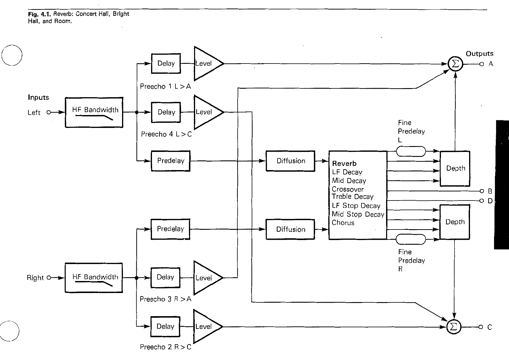

*Figure 4.1 — Reverb: Concert Hall, Bright Hall, and Room.*

### 4.1.1 Concert Hall — Program 1

Program 1, Concert Hall, was previously called the Main Hall (Program 1) in the 224. It emulates a concert hall about 120 feet long. The Treble Decay slider filters all the sound except the preechoes, giving a darker tone to the reverb than the Bright Hall program (program 2). This darker tone simulates the effect of air absorption in a real hall and helps keep the ambience generated by the program from muddying the direct sound. Additional treble rolloff can be added by lowering the HF Bandwidth slider, which also darkens the Preecho Delays.

**Variations in Concert Hall.** The Concert Hall program has five control pages and seven variations. Table 4.2 lists the control pages and the variable parameters and their ranges. All variations have four adjustable Preecho Delays; variations 2, 4, and 6 have active Preechoes.

- **Variation 1** mimics a moderately large, reverberant hall. Average running reverb decay time is 2.6 seconds: LF Decay (3.0 seconds) is longer than Mid Decay (2.0 seconds). Diffusion is 25, and Depth is moderately low (33). Predelay is 24.0 milliseconds — the minimum for this program.
- **Variation 2** sounds especially good with classical music. It emulates a smaller hall sound than variation 1; both LF and Mid Decay are 1.7 seconds. Diffusion is lower (15) than in variation 1, and there are four Preechoes. Levels are preset to add a sense of stage reflections not present in a closely miked track.
- **Variation 3** has a very low Diffusion (01) that, along with its fairly long initial reverb decay time, produces an uncolored, natural quality on flute or voice. This variation works especially well when modified to produce very long reverb times; it is not for material containing strong transients. This variation was previously called Large Concert Hall (program 3) in the 224.
- **Variation 4** is a modification of variation 3 with a slightly longer Mid Decay (3.0 seconds), less HF Bandwidth (7.5 kHz instead of 9.0), longer Predelay (42.0 milliseconds), and four active Preechoes.
- **Variation 5** is just like variation 1, except that the average reverb decay time has been increased to 6.5 seconds.
- **Variation 6** is preset with the Dynamic Decay toggle on; average stopped reverb decay time (5.7 seconds) is longer than average running reverb decay (1.7 seconds), and it contains four preset Preecho Levels. This configuration creates a wash of reverb when the music or input source stops, but maintains clarity at other times.
- **Variation 7** is also preset with the Dynamic Decay toggle on, but with the variable reverb parameter values exactly opposite to those in variation 6; i.e., the average running decay time (5.7 seconds) is longer than the average stopped decay (1.7 seconds). The result is similar to what might be obtained if the output of a reverberation device were put through a gating circuit.

#### Table 4.2 — Concert Hall: Control Pages and Variable Parameters

| Page | Slider | Parameter | Max | Min | Routing |
|---|---|---|---|---|---|
| 1 | 1 | LF Decay | 70 sec | 0.6 sec | |
| 1 | 2 | Mid Decay | 70 sec | 0.6 sec | |
| 1 | 3 | Crossover | 19.0 kHz | 170 Hz | |
| 1 | 4 | Treble Decay | 19.0 kHz | 170 Hz | |
| 1 | 5 | Depth | 99 | 00 | |
| 1 | 6 | Predelay | 216 msec | 24.0 msec | |
| 2 | 1 | LF Stop Decay | 70 sec | 0.6 sec | |
| 2 | 2 | Mid Stop Decay | 70 sec | 0.6 sec | |
| 2 | 3 | Chorus | 97 | 00 | |
| 2 | 4 | HF Bandwidth | 19.0 kHz | 170 Hz | |
| 2 | 5 | Diffusion | 99 | 00 | |
| 2 | 6 | Definition | 75 | 00 | |
| 3 | 1 | Preecho Level 1 | 99 | 00 | L>A |
| 3 | 2 | Preecho Level 2 | 99 | 00 | R>C |
| 3 | 3 | Preecho Level 3 | 99 | 00 | R>A |
| 3 | 4 | Preecho Level 4 | 99 | 00 | L>C |
| 3 | 5 | Inactive | — | — | |
| 3 | 6 | Inactive | — | — | |
| 4* | 1 | Preecho Delay 1 | 188 msec | 0.00 msec | L>A |
| 4* | 2 | Preecho Delay 2 | 188 msec | 0.00 msec | R>C |
| 4* | 3 | Preecho Delay 3 | 188 msec | 0.00 msec | R>A |
| 4* | 4 | Preecho Delay 4 | 188 msec | 0.00 msec | L>C |
| 4* | 5 | Fine Predelay L | 31.3 msec | 0.00 msec | L> |
| 4* | 6 | Fine Predelay R | 31.3 msec | 0.00 msec | R> |
| 5 | 1 | Size | 87 | 08 | |
| 5 | 3 | Gate | 5.08 sec | 0.00 sec | |

### 4.1.2 Bright Hall — Program 2

Program 2, Bright Hall, is similar to the Concert Hall program, except the Treble Decay slider affects the sound only after a few hundred milliseconds. The sound from this program is thus much brighter than that from the Concert Hall program, and many people prefer this brightness in popular music. Diffusion has also been set higher in all the variations, enhancing percussion sounds. If an even brighter sound is wanted, turn off the Mode Enhancement toggle.

**Variations in Bright Hall.** This program has five control pages and five variations. Table 4.3 lists the control pages and the variable parameter ranges. All variations have four adjustable preecho delays; variations 2 and 4 have active Preechoes.

For variations 1, 3, and 5, the HF Bandwidth control is preset to 19 kHz; for variation 2, it is 9.0 kHz; and for variation 4, 7.50 kHz.

#### Table 4.3 — Bright Hall: Control Pages and Variable Parameters

*(Ranges identical to the Concert Hall table; Size is given in meters.)*

| Page | Slider | Parameter | Max | Min | Routing |
|---|---|---|---|---|---|
| 1 | 1 | LF Decay | 70 sec | 0.6 sec | |
| 1 | 2 | Mid Decay | 70 sec | 0.6 sec | |
| 1 | 3 | Crossover | 19.0 kHz | 170 Hz | |
| 1 | 4 | Treble Decay | 19.0 kHz | 170 Hz | |
| 1 | 5 | Depth | 99 | 00 | |
| 1 | 6 | Predelay | 216 msec | 24.0 msec | |
| 2 | 1 | LF Stop Decay | 70 sec | 0.6 sec | |
| 2 | 2 | Mid Stop Decay | 70 sec | 0.6 sec | |
| 2 | 3 | Chorus | 97 | 00 | |
| 2 | 4 | HF Bandwidth | 19.0 kHz | 170 Hz | |
| 2 | 5 | Diffusion | 99 | 00 | |
| 2 | 6 | Definition | 75 | 00 | |
| 3 | 1 | Preecho Level 1 | 99 | 00 | L>A |
| 3 | 2 | Preecho Level 2 | 99 | 00 | R>C |
| 3 | 3 | Preecho Level 3 | 99 | 00 | R>A |
| 3 | 4 | Preecho Level 4 | 99 | 00 | L>C |
| 3 | 5 | Inactive | — | — | |
| 3 | 6 | Inactive | — | — | |
| 4* | 1 | Preecho Delay 1 | 188 msec | 0.00 msec | L>A |
| 4* | 2 | Preecho Delay 2 | 188 msec | 0.00 msec | R>C |
| 4* | 3 | Preecho Delay 3 | 188 msec | 0.00 msec | R>A |
| 4* | 4 | Preecho Delay 4 | 188 msec | 0.00 msec | L>C |
| 4* | 5 | Fine Predelay L | 31.3 msec | 0.00 msec | L> |
| 4* | 6 | Fine Predelay R | 31.3 msec | 0.00 msec | R> |
| 5 | 1 | Size | 87 meters | 08 meters | |
| 5 | 3 | Gate | 5.08 sec | 0.00 sec | |

### 4.1.3 Dark Hall — Program 3

Program 3, Dark Hall, is noticeably less metallic and more natural sounding than the other hall programs, especially as the sound decays. A side effect of this is a markedly darker tone color. The darkening can be removed by turning the Mode Enhancement Toggle off, which makes the reverb much brighter and more metallic. Additionally, the Treble Decay slider, which affects the sound only after a few hundred milliseconds, can be raised to compensate for the increased darkness. The Dark Hall program is the best choice when a hall sound is needed in classical music, or, for that matter, any time its darker color can be used to advantage.

> **Note:** The Chorus control is preset to 53 in all variations of the Dark Hall program. If pitch wobble is heard in material with very pure tones, such as piano or guitar, set the Chorus control to 50 or lower. Lowering this control maintains the dark tone color, but makes the sound more metallic.

**Variations in Dark Hall.** This program has five control pages and seven variations. Table 4.4 lists the control pages and variable parameter ranges. All variations have four adjustable Preecho Delays; variations 2, 4, and 6 contain active Preechoes. Note that these variations are similar in sound to those in the Concert Hall program.

#### Table 4.4 — Dark Hall: Control Pages and Variable Parameters

| Page | Slider | Parameter | Max | Min | Routing |
|---|---|---|---|---|---|
| 1 | 1 | LF Decay | 70 sec | 0.6 sec | |
| 1 | 2 | Mid Decay | 70 sec | 0.6 sec | |
| 1 | 3 | Crossover | 19.0 kHz | 170 Hz | |
| 1 | 4 | Treble Decay | 19.0 kHz | 170 Hz | |
| 1 | 5 | Depth | 99 | 00 | |
| 1 | 6 | Predelay | 176 msec | 24.0 msec | |
| 2 | 1 | LF Stop Decay | 70 sec | 0.6 sec | |
| 2 | 2 | Mid Stop Decay | 70 sec | 0.6 sec | |
| 2 | 3 | Chorus | 97 | 00 | |
| 2 | 4 | HF Bandwidth | 19.0 kHz | 170 Hz | |
| 2 | 5 | Diffusion | 99 | 00 | |
| 2 | 6 | Definition | 75 | 00 | |
| 3 | 1 | Preecho Level 1 | 99 | 00 | L>AD |
| 3 | 2 | Preecho Level 2 | 99 | 00 | R>CB |
| 3 | 3 | Preecho Level 3 | 99 | 00 | R>AD |
| 3 | 4 | Preecho Level 4 | 99 | 00 | L>CB |
| 3 | 5 | Inactive | — | — | |
| 3 | 6 | Inactive | — | — | |
| 4* | 1 | Preecho Delay 1 | 143 msec | 0.00 msec | L>AD |
| 4* | 2 | Preecho Delay 2 | 143 msec | 0.00 msec | R>CB |
| 4* | 3 | Preecho Delay 3 | 143 msec | 0.00 msec | R>AD |
| 4* | 4 | Preecho Delay 4 | 143 msec | 0.00 msec | L>CB |
| 4* | 5 | Fine Predelay L | 31.3 msec | 0.00 msec | L> |
| 4* | 6 | Fine Predelay R | 31.3 msec | 0.00 msec | R> |
| 5 | 1 | Size | 40 | 05 | |
| 5 | 3 | Gate | 5.08 sec | 0.00 sec | |

The Dark Hall and Small Room programs share the block topology in Figure 4.2.

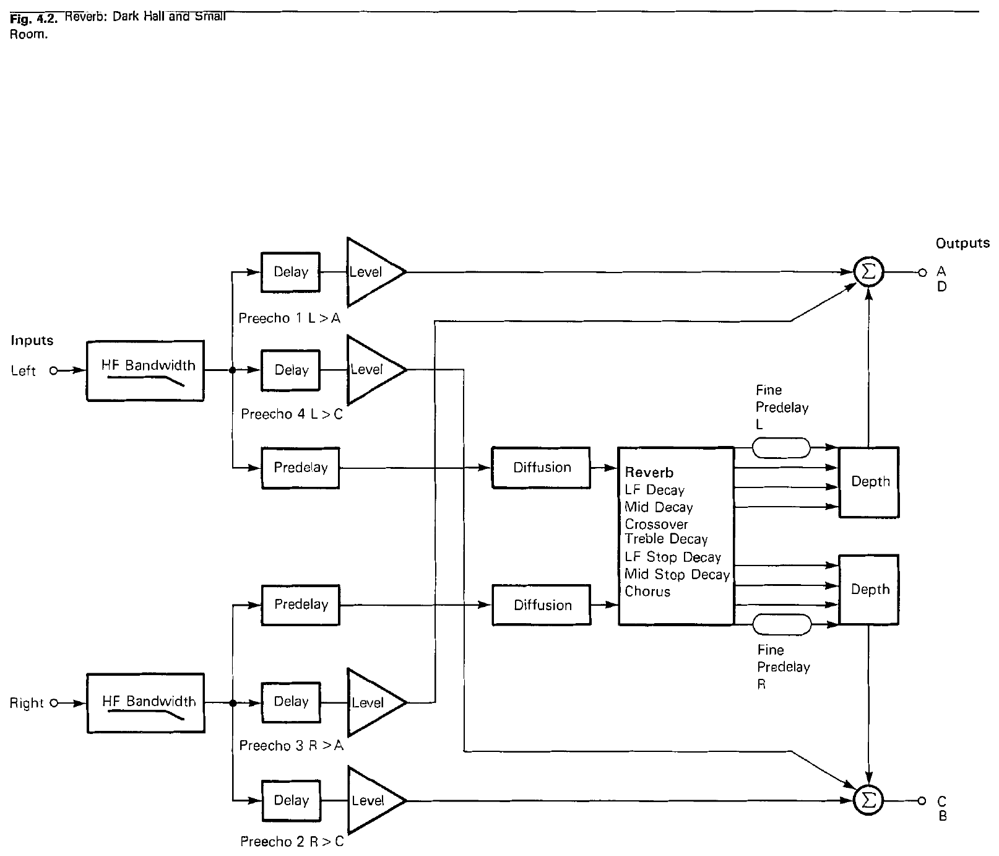

*Figure 4.2 — Reverb: Dark Hall and Small Room.*

---

## 4.2 Rooms — Bank 2

This bank comprises the Room, Small Room, Chamber, Rich Chamber, Dark Chamber, and Inverse Room programs. The general configuration of the control pages for the Room programs is the same as for the Hall programs; the Chamber and Inverse Room programs are slightly different.

Like the Concert and Bright Hall programs, the Room program has both stereo or quad outputs. For stereo operation, use Output A for left and C for right. For quad, assign Outputs A and C to the left and right rear channels and B and D to the left and right front channels, respectively. Note: The Depth slider affects Outputs A and C only.

The Small Room, Rich and Dark Chamber programs have stereo outputs: the left output is A and the right is C.

The Chamber program also has stereo outputs; however, this program digitally averages its two inputs to mono. The main left output is A and the main right output is C. If only one input feed is available, bridge it to both Right and Left inputs. Note that Output A has less inherent predelay than Output C, and this difference is noticeable on some material as a shift in apparent position in the stereo image. Outputs D and B, which are derived from A and C and do not have different predelays, can be used for better timing characteristics but introduce a marked coloration from Output D. For a single (mono) output, do not use Output D because of its coloration.

### 4.2.1 Room and Small Room — Programs 1 and 2

Programs 1 and 2, Room and Small Room, are similar to the Hall programs, but the spaces they emulate are smaller. The Room programs have higher effective diffusion than the halls, because sound evens out more quickly in smaller spaces. They are useful when density or a sense of acoustic space needs to be added to a sound. The Room program emulates a space 30 to 50 feet long (about 1/2 the size and 1/8 the volume of the Concert Hall program), and Small Room a space about half that length (1/8th the volume again). The Small Room program in particular increases the apparent loudness of spoken material without raising its peak level or degrading intelligibility. (The reverberation has high articulation.) Both programs are ideal for broadcast or film work and can be very useful on vocals or drums.

The Small Room program is ideal for dubbing film dialog in scenes that take place in confined spaces. In addition, it is very good for fattening vocals and for enhancing percussion. Like the Dark Hall program, the Small Room program is noticeably less metallic and more natural sounding, especially as the sound decays, which darkens the tone of the reverb. To some degree, this darkening can be compensated for by raising the Treble Decay slider, or it can be removed entirely by turning off the Mode Enhancement toggle, which makes the reverb much brighter and more metallic.

> **Note:** The Chorus control is preset to 53 in all variations of the Room and Small Room programs. If pitch wobble is heard in material with very pure tones, such as piano or guitar, set the Chorus control to 50 or lower. Lowering this control maintains the dark tone color, but makes the sound more metallic.

**Variations in Room and Small Room.** The Room program has five control pages and four variations. Table 4.5 lists the control pages and variable parameter ranges. All variations have four adjustable Preecho Delays; variations 2 and 4 have four active Preechoes.

- **Variation 1** has a fairly long average reverb decay time (1.4 seconds) given the small size of the space that it emulates. The HF Bandwidth control is preset at 7.5 kHz, and Depth is fairly high at 33.
- **Variation 2** is similar to variation 1, except that the four Preecho Delays are preset at moderate levels, ranging from 6.5 to 21 milliseconds.
- **Variation 3** has a short average running reverb decay time (0.5 seconds) with full HF Bandwidth (19.0 kHz), but with rapid Treble Decay (4.5 kHz). This variation is especially suitable for percussion.
- **Variation 4** is a modified version of variation 3 and has four Preecho Delays preset to much higher levels than in variation 2.

The Room program uses the topology in Figure 4.1; the Small Room program uses the topology in Figure 4.2 (both shown in §4.1).

#### Table 4.5 — Room: Control Pages and Variable Parameters

| Page | Slider | Parameter | Max | Min | Routing |
|---|---|---|---|---|---|
| 1 | 1 | LF Decay | 35 sec | 0.3 sec | |
| 1 | 2 | Mid Decay | 35 sec | 0.3 sec | |
| 1 | 3 | Crossover | 19.0 kHz | 170 Hz | |
| 1 | 4 | Treble Decay | 19.0 kHz | 170 Hz | |
| 1 | 5 | Depth | 99 | 00 | |
| 1 | 6 | Predelay | 360 msec | 24.0 msec | |
| 2 | 1 | LF Stop Decay | 35 sec | 0.3 sec | |
| 2 | 2 | Mid Stop Decay | 35 sec | 0.3 sec | |
| 2 | 3 | Chorus | 97 | 00 | |
| 2 | 4 | HF Bandwidth | 19.0 kHz | 170 Hz | |
| 2 | 5 | Diffusion | 99 | 00 | |
| 2 | 6 | Definition | 75 | 00 | |
| 3 | 1 | Preecho Level 1 | 99 | 00 | L>A |
| 3 | 2 | Preecho Level 2 | 99 | 00 | R>C |
| 3 | 3 | Preecho Level 3 | 99 | 00 | R>A |
| 3 | 4 | Preecho Level 4 | 99 | 00 | L>C |
| 3 | 5 | Inactive | — | — | |
| 3 | 6 | Inactive | — | — | |
| 4* | 1 | Preecho Delay 1 | 322 msec | 0.00 msec | L>A |
| 4* | 2 | Preecho Delay 2 | 322 msec | 0.00 msec | R>C |
| 4* | 3 | Preecho Delay 3 | 322 msec | 0.00 msec | R>A |
| 4* | 4 | Preecho Delay 4 | 322 msec | 0.00 msec | L>C |
| 4* | 5 | Fine Predelay L | 30.2 msec | 0.00 msec | L> |
| 4* | 6 | Fine Predelay R | 30.2 msec | 0.00 msec | R> |
| 5 | 1 | Size | 87 meters | 08 meters | |
| 5 | 3 | Gate | 1.26 sec | 0.00 sec | |

The Small Room program has four control pages and four variations that include very short reverb decay times and high articulation. Table 4.6 lists the control pages and variable parameter ranges. Variations 2 and 4 have four preset Preecho Delays that are similar to those in the Room program, except that both the decay times and predelay times are shorter.

#### Table 4.6 — Small Room: Control Pages and Variable Parameters

| Page | Slider | Parameter | Max | Min | Routing |
|---|---|---|---|---|---|
| 1 | 1 | LF Decay | 23 sec | 0.2 sec | |
| 1 | 2 | Mid Decay | 23 sec | 0.2 sec | |
| 1 | 3 | Crossover | 19.0 kHz | 170 Hz | |
| 1 | 4 | Treble Decay | 19.0 kHz | 170 Hz | |
| 1 | 5 | Depth | 99 | 00 | |
| 1 | 6 | Predelay | 348 msec | 12.0 msec | |
| 2 | 1 | LF Stop Decay | 23 sec | 0.2 sec | |
| 2 | 2 | Mid Stop Decay | 23 sec | 0.2 sec | |
| 2 | 3 | Chorus | 97 | 00 | |
| 2 | 4 | HF Bandwidth | 19.0 kHz | 170 Hz | |
| 2 | 5 | Diffusion | 99 | 00 | |
| 2 | 6 | Definition | 75 | 00 | |
| 3 | 1 | Preecho Level 1 | 99 | 00 | L>AD |
| 3 | 2 | Preecho Level 2 | 99 | 00 | R>CB |
| 3 | 3 | Preecho Level 3 | 99 | 00 | R>AD |
| 3 | 4 | Preecho Level 4 | 99 | 00 | L>CB |
| 3 | 5 | Inactive | — | — | |
| 3 | 6 | Inactive | — | — | |
| 4* | 1 | Preecho Delay 1 | 322 msec | 0.00 msec | L>AD |
| 4* | 2 | Preecho Delay 2 | 322 msec | 0.00 msec | R>CB |
| 4* | 3 | Preecho Delay 3 | 322 msec | 0.00 msec | R>AD |
| 4* | 4 | Preecho Delay 4 | 322 msec | 0.00 msec | L>CB |
| 4* | 5 | Fine Predelay L | 30.2 msec | 0.00 msec | L> |
| 4* | 6 | Fine Predelay R | 30.2 msec | 0.00 msec | R> |

### 4.2.2 Chamber, Rich Chamber, and Dark Chamber — Programs 3, 4, and 5

Programs 3, 4, and 5, Chamber, Rich Chamber, and Dark Chamber, have some attributes of both the Hall and Plate programs (see Sec. 4.3). They have very few size cues — giving a relatively smooth decay with time after a short build-up period.

The Chamber program has relatively low initial diffusion, even with the Diffusion control raised; however, diffusion increases rapidly after a few hundred milliseconds. This program sounds like a small echo chamber, but with less initial diffusion. It works well on many types of popular music, and sounds very different from the Plate programs because of its initial sound. The Depth control found in the Hall and Room programs is replaced by an Attack control on page 1, which controls the explosiveness of attack on percussion.

> **Caution:** The Chamber program may feed back internally if the Mid Decay is set much higher than the LF Decay and if the Treble Decay and HF Bandwidth sliders are set too high. This feedback can be defeated by lowering the Treble Decay slider (it might, of course, be useful as a special effect).

The algorithm used in Rich Chamber produces an even, relatively dimensionless reverberation, with little change in color as the sound decays. The initial diffusion is similar to the Hall or Room programs, but the sense of space or size is much less obvious. This characteristic, along with the low color in the decay tail, make the Rich Chamber program useful for a wide variety of material.

When the Diffusion control is set to a low or moderate level, this program is good on classical music, especially piano (where a short reverberation time is recommended) or organ music (with long reverberation times). With a high diffusion setting, the program emulates a well-diffused large acoustic chamber and is exciting on all types of popular music.

The Dark Chamber is very similar to the Rich Chamber. The primary difference is that the Dark Chamber has a sharp filter which limits its response above 10 kHz. This emulates the effect of air absorption in a real acoustic space, providing a very natural sound. The Dark Chamber is useful in a wide variety of classical and mixed popular music.

The Rich and Dark Chambers have six adjustable Preecho Delays, but unlike most 224X programs, these Preecho Delays are affected by the Diffusion control. As the Diffusion slider is raised, each preecho becomes a diffused cluster. This added diffusion allows the Preecho Delays to be used to create an adjustable sense of space to the otherwise dimensionless reverberation. For example, a large hall sound could be created by setting the Predelay control to 100 milliseconds or so, and then filling in the sound before this delay with diffused preechoes. Clusters of preechoes of various amplitudes around 30 and 75 milliseconds seem to be quite effective in putting the basic reverberation behind the music, not on top of it. Even with such preecho and predelay manipulation, the sense of spaciousness is not as great as in the Hall programs, which are probably preferable when a great increase in spaciousness is wanted. However, the Rich and Dark Chamber programs seem to provide a greater increase in apparent loudness and richness for the same peak level than the Hall programs and has lower color, especially in the decay tail. The Rich and Dark Chamber programs are excellent on spoken voice, giving a good increase in loudness with very low color.

The Size control adds a great deal of flexibility to the Rich Chamber program. When set to sizes of 16 meters or less, the Rich Chamber is tight and articulate — a very useful sound for dialog and music. Larger sizes (around 60 meters) give an excellent concert hall sound, especially if the Diffusion control is set to about 50.

Low settings of Treble Decay can cause some unevenness in decay with these programs. Settings below about 6 kHz with long reverb times can be problematic. If a darker sound is wanted, use the HF Bandwidth control, not the Treble Decay control.

**Variations.** The Chamber program has two control pages and only one variation. Table 4.7 lists its control pages and variable parameter ranges.

The Rich Chamber and Dark Chamber programs have five control pages and eight variations each. Tables 4.8 and 4.9 list the control pages and variable parameter ranges for the Rich Chamber and Dark Chamber, respectively. All variations have six adjustable Preecho Delays that are affected by the diffusion slider. Variations 2, 3, 5, and 6 have active Preechoes and emulate spaces of increasing size. Variation 4 is a medium size, high diffusion room, useful for percussion. Variation 7 is preset to provide a demonstration of the Infinite Reverb control feature. Variation 8 is designed to be used for Gated Reverb effects.

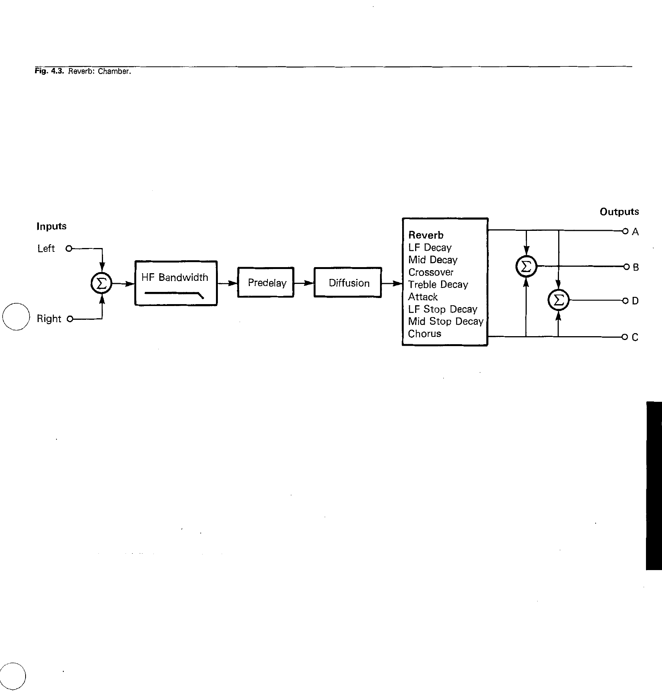

*Figure 4.3 — Reverb: Chamber.*

#### Table 4.7 — Chamber: Control Pages and Variable Parameters

| Page | Slider | Parameter | Max | Min | Routing |
|---|---|---|---|---|---|
| 1 | 1 | LF Decay | 70 sec | 0.6 sec | |
| 1 | 2 | Mid Decay | 70 sec | 0.6 sec | |
| 1 | 3 | Crossover | 19.0 kHz | 170 Hz | |
| 1 | 4 | Treble Decay | 19.0 kHz | 170 Hz | |
| 1 | 5 | Attack | 99 | 00 | |
| 1 | 6 | Predelay | 249 msec | 25.0 msec | |
| 2 | 1 | LF Stop Decay | 70 sec | 0.6 sec | |
| 2 | 2 | Mid Stop Decay | 70 sec | 0.6 sec | |
| 2 | 3 | Chorus | 97 | 00 | |
| 2 | 4 | HF Bandwidth | 19.0 kHz | 170 Hz | |
| 2 | 5 | Diffusion | 99 | 00 | |
| 2 | 6 | Inactive | — | — | |

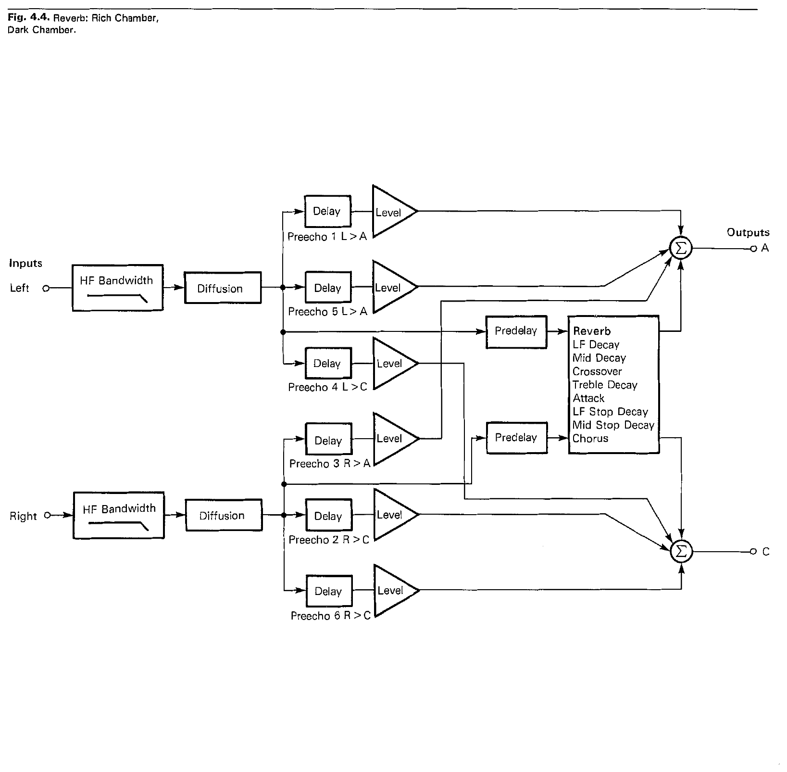

*Figure 4.4 — Reverb: Rich Chamber, Dark Chamber.*

#### Table 4.8 — Rich Chamber: Control Pages and Variable Parameters

*(`*` = value can also be set to infinite.)*

| Page | Slider | Parameter | Max | Min | Routing |
|---|---|---|---|---|---|
| 1 | 1 | LF Decay | 83 sec * | 0.1 sec | |
| 1 | 2 | Mid Decay | 83 sec * | 0.1 sec | |
| 1 | 3 | Crossover | 19.0 kHz * | 170 Hz | |
| 1 | 4 | Treble Decay | 19.0 kHz * | 170 Hz | |
| 1 | 5 | Attack | 99 | 00 | |
| 1 | 6 | Predelay | 834 ms | 0.00 ms | |
| 2 | 1 | LF Stop Decay | 83 sec * | 0.1 sec | |
| 2 | 2 | Mid Stop Decay | 83 sec * | 0.1 sec | |
| 2 | 3 | Chorus | 99 | 00 | |
| 2 | 4 | HF Bandwidth | 19 kHz * | 170 Hz | |
| 2 | 5 | Diffusion | 99 | 00 | |
| 2 | 6 | Definition | 99 | 00 | |
| 3 | 1 | Preecho Level 1 | 99 | 00 | L>AD |
| 3 | 2 | Preecho Level 2 | 99 | 00 | R>CB |
| 3 | 3 | Preecho Level 3 | 99 | 00 | R>AD |
| 3 | 4 | Preecho Level 4 | 99 | 00 | L>CB |
| 3 | 5 | Preecho Level 5 | 99 | 00 | L>AD |
| 3 | 6 | Preecho Level 6 | 99 | 00 | R>CB |
| 4 | 1 | Preecho Delay 1 | 125 ms | 0.00 ms | L>AD |
| 4 | 2 | Preecho Delay 2 | 125 ms | 0.00 ms | R>CB |
| 4 | 3 | Preecho Delay 3 | 125 ms | 0.00 ms | R>AD |
| 4 | 4 | Preecho Delay 4 | 125 ms | 0.00 ms | L>CB |
| 4 | 5 | Preecho Delay 5 | 125 ms | 0.00 ms | L>AD |
| 4 | 6 | Preecho Delay 6 | 125 ms | 0.00 ms | R>CB |
| 5 | 1 | Size | 87 meters | 08 meters | |
| 5 | 2 | Inactive | — | — | |
| 5 | 3 | Reverb Stop Delay (Gate) | 1.26 sec | 0.00 sec | |
| 5 | 4 | Inactive | — | — | |
| 5 | 5 | Inactive | — | — | |
| 5 | 6 | Inactive | — | — | |

#### Table 4.9 — Dark Chamber: Control Pages and Variable Parameters

*(`*` = value can also be set to infinite. Identical to Rich Chamber except Predelay max = 830 ms.)*

| Page | Slider | Parameter | Max | Min | Routing |
|---|---|---|---|---|---|
| 1 | 1 | LF Decay | 83 sec * | 0.1 sec | |
| 1 | 2 | Mid Decay | 83 sec * | 0.1 sec | |
| 1 | 3 | Crossover | 19.0 kHz * | 170 Hz | |
| 1 | 4 | Treble Decay | 19.0 kHz * | 170 Hz | |
| 1 | 5 | Attack | 99 | 00 | |
| 1 | 6 | Predelay | 830 ms | 000 ms | |
| 2 | 1 | LF Stop Decay | 83 sec * | 0.1 sec | |
| 2 | 2 | Mid Stop Decay | 83 sec * | 0.1 sec | |
| 2 | 3 | Chorus | 99 | 00 | |
| 2 | 4 | HF Bandwidth | 19.0 kHz * | 170 Hz | |
| 2 | 5 | Diffusion | 99 | 00 | |
| 2 | 6 | Definition | 99 | 00 | |
| 3 | 1 | Preecho Level 1 | 99 | 00 | L>AD |
| 3 | 2 | Preecho Level 2 | 99 | 00 | R>CB |
| 3 | 3 | Preecho Level 3 | 99 | 00 | R>AD |
| 3 | 4 | Preecho Level 4 | 99 | 00 | L>CB |
| 3 | 5 | Preecho Level 5 | 99 | 00 | L>AD |
| 3 | 6 | Preecho Level 6 | 99 | 00 | R>CB |
| 4 | 1 | Preecho Delay 1 | 125 ms | 0.00 ms | L>AD |
| 4 | 2 | Preecho Delay 2 | 125 ms | 0.00 ms | R>CB |
| 4 | 3 | Preecho Delay 3 | 125 ms | 0.00 ms | R>AD |
| 4 | 4 | Preecho Delay 4 | 125 ms | 0.00 ms | L>CB |
| 4 | 5 | Preecho Delay 5 | 125 ms | 0.00 ms | L>AD |
| 4 | 6 | Preecho Delay 6 | 125 ms | 0.00 ms | R>CB |
| 5 | 1 | Size | 87 meters | 08 meters | |
| 5 | 2 | Inactive | — | — | |
| 5 | 3 | Reverb Stop Delay (Gate) | 1.26 sec | 0.00 sec | |
| 5 | 4 | Inactive | — | — | |
| 5 | 5 | Inactive | — | — | |
| 5 | 6 | Inactive | — | — | |

### 4.2.3 Inverse Room — Program 6

The Inverse Room program allows the envelope of the reverb tail to be continuously varied, using the Slope control. The effect is similar to a gate, but does not depend at all on the level or complexity of the input signal.

When the Slope control is set at less than 50, the Inverse Room program produces a reverb that sounds similar to a normal room for a fraction of a second, and then drops off abruptly. The length of time until the sound cuts off is set by the Size control. The apparent reverb time until the sound abruptly ends is set by the Slope control.

If the Slope control is set at 50, the sound does not decay until the cut-off (i.e., amplitude is constant). This is sometimes referred to as a level slope effect.

If the Slope control is set above 50, the sound increases in level until the cutoff, producing what is sometimes referred to as inverse reverb. The resulting sound can have great impact and interest.

The Inverse Room program can also be used to enhance a vocal or speaking voice by adding volume without adding apparent reverb or increasing the peak level of the input signal. To produce this "enhance" effect, set the Slope control to about 30, and the diffusion control to about 20. Use the Size control to match the articulation of the input signal. For speech, size values of 10 to 20 meters are a good starting point.

**Variations.** The Inverse Room program has five control pages and three variations. Table 4.10 lists the control pages and variable parameter ranges.

- **Variation 1** produces a level slope effect.
- **Variation 2** produces inverse reverb.
- **Variation 3** is preset for the enhance effect.

#### Table 4.10 — Inverse Room: Control Pages and Variable Parameters

| Page | Slider | Parameter | Max | Min | Routing |
|---|---|---|---|---|---|
| 1 | 1 | LF Decay | 83 sec | 0.1 sec | |
| 1 | 2 | Mid Decay | 83 sec | 0.1 sec | |
| 1 | 3 | Crossover | 19 kHz | 170 Hz | |
| 1 | 4 | Treble Decay | 19 kHz | 170 Hz | |
| 1 | 5 | Attack | 99 | 00 | |
| 1 | 6 | Predelay | 830 ms | 000 ms | |
| 2 | 1 | LF Stop Decay | 83 sec | 0.1 sec | |
| 2 | 2 | Mid Stop Decay | 83 sec | 0.1 sec | |
| 2 | 3 | Chorus | 99 | 00 | |
| 2 | 4 | HF Bandwidth | 19 kHz | 170 Hz | |
| 2 | 5 | Diffusion | 99 | 00 | |
| 2 | 6 | Definition | 99 | 00 | |
| 3 | 1 | Decay Slope | 99 | 00 | |
| 3 | 2 | Preecho Level 2 | 99 | 00 | R>CB |
| 3 | 3 | Preecho Level 3 | 99 | 00 | R>AD |
| 3 | 4 | Preecho Level 4 | 99 | 00 | L>CB |
| 3 | 5 | Preecho Level 5 | 99 | 00 | L>AD |
| 3 | 6 | Preecho Level 6 | 99 | 00 | R>CB |
| 4 | 1 | Preecho Delay 1 | 125 ms | 0.00 ms | L>AD |
| 4 | 2 | Preecho Delay 2 | 125 ms | 0.00 ms | R>CB |
| 4 | 3 | Preecho Delay 3 | 125 ms | 0.00 ms | R>AD |
| 4 | 4 | Preecho Delay 4 | 125 ms | 0.00 ms | L>CB |
| 4 | 5 | Preecho Delay 5 | 125 ms | 0.00 ms | L>AD |
| 4 | 6 | Preecho Delay 6 | 125 ms | 0.00 ms | R>CB |
| 5 | 1 | Size | 87 meters | 08 meters | |
| 5 | 3 | Reverb Stop Delay (Gate) | 1.26 sec | 0.00 sec | |

---

## 4.3 Plates — Bank 3

The Plate programs have high initial diffusion and bright, colored sound. For this reason, they have traditionally been chosen for percussion. With the variable parameters available on the 224X, they are useful for a wider variety of tasks as well. The 224X has five Plate programs: Plate, Small Plate, Constant-Density (CD) Plate A, Constant-Density (CD) Plate B, and Rich Plate. The Plate programs have four or five control pages; an Attack slider on page 1 controls the explosiveness of the attack on percussive material.

All five Plate programs share the block topology in Figure 4.5.

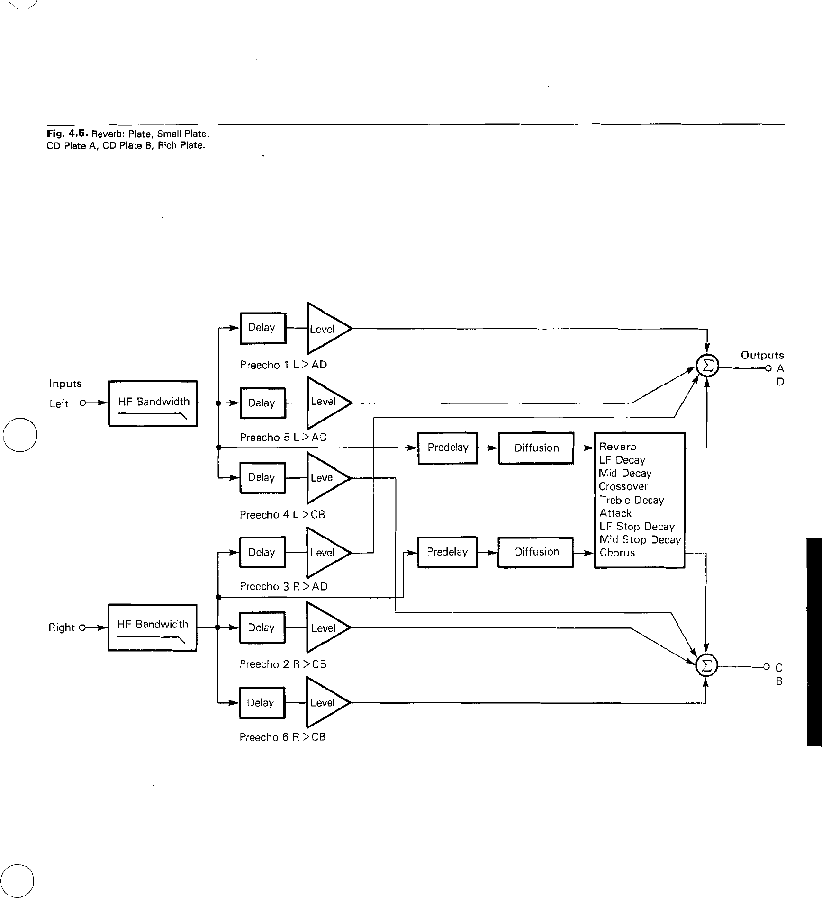

*Figure 4.5 — Reverb: Plate, Small Plate, CD Plate A, CD Plate B, Rich Plate.*

### 4.3.1 Plate and Small Plate — Programs 1 and 2

The Plate program mimics the sounds of many types of metal plates and was the original plate program in the 224. When the Diffusion control is set low, the Plate program has a very clear sound that is excellent on vocals and can be used with Preechoes to create a wide variety of acoustic environments. When diffusion is high, this program gives a smooth, dense sound with applications in all popular music. Mono compatibility of the outputs is very good, but for best results percussive material should be panned to the middle of the stereo feed.

The Small Plate program is almost an exact duplicate of the Plate program, except that it sounds tighter, more diffuse, and smoother, especially on transients. Its very high diffusion gives it a characteristically mellow sound that is useful on a wide variety of popular music, especially percussion.

**Variations in Plate and Small Plate.** The Plate program has five control pages and six variations. Table 4.11 lists the control pages and the variable parameter ranges. All variations have six preset Preecho Delays; variations 3 and 4 have active Preechoes.

- **Variation 1** is brighter and more metallic-sounding than any of the Hall programs. Attack and Predelay are both 0, giving a crisp, slightly thin sound, and a strong attack. Diffusion is high (58). Average running reverb decay time is 1.8 seconds, and the HF Bandwidth control is preset at 7.5 kHz.
- **Variation 2's** short average reverb decay time (0.6 seconds for low frequencies and 1.8 seconds for midrange frequencies) and very low crossover (170 Hz) create a hard, slightly garagelike quality. With drums, the sound suggests a small hard-walled space without booming from the kick drum. The HF Bandwidth control is set to maximum — 19 kHz.
- **Variation 3** has a reduced HF Bandwidth setting (7.50 kHz) to mimic air absorption. Attack is high (80) to eliminate explosive sound, Diffusion is low (31), Definition is high (58), and there is long reverb decay time (4.2 seconds for low frequencies and 3.0 seconds for midrange frequencies). This variation sounds like a large, stone-lined church. It has six Preechoes, creating the impression of an actual church acoustical environment instead of simply adding a "churchy" sound to a dry track.
- **Variation 4** is a version of variation 3, with longer average reverb decay time: 7.5 seconds for low frequencies and 5.2 seconds for midrange frequencies. Like variation 3, it has six Preechoes. This variation produces a cavernous quality typical of large reverberant spaces.
- **Variation 5** is an updated version of the percussion plate program that was called program 5 in the 224. Its very high initial diffusion (58) can be decreased to make a clear sound for vocals.
- **Variation 6** is like variation 3, but without Preechoes. It has a long reverb decay time (4.2 seconds for low frequencies and 3.0 seconds for midrange frequencies), but leaves more space around the performer. Although it does not simulate a church as realistically as variation 3, it is useful for adding churchlike reverb to recordings that already have some spaciousness, such as organ recordings made in moderately dry spaces.

#### Table 4.11 — Plate: Control Pages and Variable Parameters

| Page | Slider | Parameter | Max | Min | Routing |
|---|---|---|---|---|---|
| 1 | 1 | LF Decay | 70 sec | 0.6 sec | |
| 1 | 2 | Mid Decay | 70 sec | 0.6 sec | |
| 1 | 3 | Crossover | 19.0 kHz | 170 Hz | |
| 1 | 4 | Treble Decay | 19.0 kHz | 170 Hz | |
| 1 | 5 | Attack | 99 | 00 | |
| 1 | 6 | Predelay | 176 msec | 0.00 msec | |
| 2 | 1 | LF Stop Decay | 70 sec | 0.6 sec | |
| 2 | 2 | Mid Stop Decay | 70 sec | 0.6 sec | |
| 2 | 3 | Chorus | 97 | 00 | |
| 2 | 4 | HF Bandwidth | 19.0 kHz | 170 Hz | |
| 2 | 5 | Diffusion | 99 | 00 | |
| 2 | 6 | Definition | 75 | 00 | |
| 3 | 1 | Preecho Level 1 | 99 | 00 | L>AD |
| 3 | 2 | Preecho Level 2 | 99 | 00 | R>CB |
| 3 | 3 | Preecho Level 3 | 99 | 00 | R>AD |
| 3 | 4 | Preecho Level 4 | 99 | 00 | L>CB |
| 3 | 5 | Preecho Level 5 | 99 | 00 | L>AD |
| 3 | 6 | Preecho Level 6 | 99 | 00 | R>CB |
| 4* | 1 | Preecho Delay 1 | 170 msec | 0.00 msec | L>AD |
| 4* | 2 | Preecho Delay 2 | 170 msec | 0.00 msec | R>CB |
| 4* | 3 | Preecho Delay 3 | 170 msec | 0.00 msec | R>AD |
| 4* | 4 | Preecho Delay 4 | 170 msec | 0.00 msec | L>CB |
| 4* | 5 | Preecho Delay 5 | 170 msec | 0.00 msec | L>AD |
| 4* | 6 | Preecho Delay 6 | 170 msec | 0.00 msec | R>CB |
| 5 | 1 | Size | 40 meters | 10 meters | |
| 5 | 3 | Gate | 5.08 sec | 0.00 sec | |

Like the Plate program, the Small Plate program has five control pages with six variations. Table 4.12 lists the control pages and the variable parameter ranges. All variations have six preset Preecho Delays; variations 3 and 4 have active Preechoes.

#### Table 4.12 — Small Plate: Control Pages and Variable Parameters

| Page | Slider | Parameter | Max | Min | Routing |
|---|---|---|---|---|---|
| 1 | 1 | LF Decay | 44 sec | 0.4 sec | |
| 1 | 2 | Mid Decay | 44 sec | 0.4 sec | |
| 1 | 3 | Crossover | 19.0 kHz | 170 Hz | |
| 1 | 4 | Treble Decay | 19.0 kHz | 170 Hz | |
| 1 | 5 | Attack | 99 | 00 | |
| 1 | 6 | Predelay | 304 msec | 0.00 msec | |
| 2 | 1 | LF Stop Decay | 44 sec | 0.4 sec | |
| 2 | 2 | Mid Stop Decay | 44 sec | 0.4 sec | |
| 2 | 3 | Chorus | 97 | 00 | |
| 2 | 4 | HF Bandwidth | 19.0 kHz | 170 Hz | |
| 2 | 5 | Diffusion | 99 | 00 | |
| 2 | 6 | Definition | 75 | 00 | |
| 3 | 1 | Preecho Level 1 | 99 | 00 | L>AD |
| 3 | 2 | Preecho Level 2 | 99 | 00 | R>CB |
| 3 | 3 | Preecho Level 3 | 99 | 00 | R>AD |
| 3 | 4 | Preecho Level 4 | 99 | 00 | L>CB |
| 3 | 5 | Preecho Level 5 | 99 | 00 | L>AD |
| 3 | 6 | Preecho Level 6 | 99 | 00 | R>CB |
| 4* | 1 | Preecho Delay 1 | 286 msec | 0.00 msec | L>AD |
| 4* | 2 | Preecho Delay 2 | 286 msec | 0.00 msec | R>CB |
| 4* | 3 | Preecho Delay 3 | 286 msec | 0.00 msec | R>AD |
| 4* | 4 | Preecho Delay 4 | 286 msec | 0.00 msec | L>CB |
| 4* | 5 | Preecho Delay 5 | 286 msec | 0.00 msec | L>AD |
| 4* | 6 | Preecho Delay 6 | 286 msec | 0.00 msec | R>CB |
| 5 | 1 | Size | 40 meters | 10 meters | |
| 5 | 3 | Gate | 5.08 sec | 0.00 sec | |

### 4.3.2 Constant-Density (CD) Plates A and B — Programs 3 and 4

The density of the echoes in natural acoustic spaces, as in most 224X programs, increases with time. When a sound is made in a hall, relatively few reflections exist at first, but as the number of echoes increases, so do both the smoothness of the reverb and the amount of coloration in the sound. The CD Plate programs act differently. They start out with very high initial diffusion and maintain a constant echo density thereafter. The rate of decay is also constant with time, instead of beginning rapidly and then slowing as time progresses. For these programs, the Decay Optimization toggle is inactive.

The CD Plate A program was originally developed for the 224; it emulates a sound that is well known in the industry; CD Plate B has a more spacious sound and better mono compatibility.

**Variations in Constant-Density Plates A and B.** The CD Plate A program has four control pages and only one variation. The variation has six active Preechoes. Table 4.13 lists the control pages and variable parameter ranges. Average running reverb decay time is 1.8 seconds, with an HF Bandwidth of 19.0 kHz and a Treble Decay of 15 kHz. Attack is preset at 12, and Diffusion at 58.

The CD Plate B program has four control pages and three variations. Table 4.14 lists the control pages and the variable parameter ranges. All variations have six preset preecho delays; variation 3 has active Preechoes.

- **Variation 1** is much like CD Plate A. Its average running reverb decay time is 1.8 seconds, HF Bandwidth is preset at 7.5 kHz, and Treble Decay at 15 kHz. Attack is preset at 33 and Diffusion at 58.
- **Variation 2** produces a brighter sound, with short reverb decay time, especially suited to percussion. The HF Bandwidth control is a full 19 kHz, and LF and Mid Decay are both at 0.6 seconds.
- **Variation 3** is like variation 1, but with four Preechoes, all occurring before 10 milliseconds.

#### Table 4.13 — Constant-Density Plate A: Control Pages and Variable Parameters

| Page | Slider | Parameter | Max | Min | Routing |
|---|---|---|---|---|---|
| 1 | 1 | LF Decay | 70 sec | 0.6 sec | |
| 1 | 2 | Mid Decay | 70 sec | 0.6 sec | |
| 1 | 3 | Crossover | 19.0 kHz | 170 Hz | |
| 1 | 4 | Treble Decay | 19.0 kHz | 170 Hz | |
| 1 | 5 | Attack | 99 | 00 | |
| 1 | 6 | Predelay | 181 msec | 5.00 msec | |
| 2 | 1 | LF Stop Decay | 70 sec | 0.6 sec | |
| 2 | 2 | Mid Stop Decay | 70 sec | 0.6 sec | |
| 2 | 3 | Chorus | 56 | 00 | |
| 2 | 4 | HF Bandwidth | 19.0 kHz | 170 Hz | |
| 2 | 5 | Diffusion | 99 | 00 | |
| 2 | 6 | Inactive | — | — | |
| 3 | 1 | Preecho Level 1 | 99 | 00 | L>AD |
| 3 | 2 | Preecho Level 2 | 99 | 00 | R>CB |
| 3 | 3 | Preecho Level 3 | 99 | 00 | R>AD |
| 3 | 4 | Preecho Level 4 | 99 | 00 | L>CB |
| 3 | 5 | Preecho Level 5 | 99 | 00 | L>AD |
| 3 | 6 | Preecho Level 6 | 99 | 00 | R>CB |
| 4* | 1 | Preecho Delay 1 | 170 msec | 0.00 msec | L>AD |
| 4* | 2 | Preecho Delay 2 | 170 msec | 0.00 msec | R>CB |
| 4* | 3 | Preecho Delay 3 | 170 msec | 0.00 msec | R>AD |
| 4* | 4 | Preecho Delay 4 | 170 msec | 0.00 msec | L>CB |
| 4* | 5 | Preecho Delay 5 | 170 msec | 0.00 msec | L>AD |
| 4* | 6 | Preecho Delay 6 | 170 msec | 0.00 msec | R>CB |

#### Table 4.14 — Constant-Density Plate B: Control Pages and Variable Parameters

| Page | Slider | Parameter | Max | Min | Routing |
|---|---|---|---|---|---|
| 1 | 1 | LF Decay | 70 sec | 0.6 sec | |
| 1 | 2 | Mid Decay | 70 sec | 0.6 sec | |
| 1 | 3 | Crossover | 19.0 kHz | 170 Hz | |
| 1 | 4 | Treble Decay | 19.0 kHz | 170 Hz | |
| 1 | 5 | Attack | 99 | 00 | |
| 1 | 6 | Predelay | 120 msec | 0.00 msec | |
| 2 | 1 | LF Stop Decay | 70 sec | 0.6 sec | |
| 2 | 2 | Mid Stop Decay | 70 sec | 0.6 sec | |
| 2 | 3 | Chorus | 56 | 00 | |
| 2 | 4 | HF Bandwidth | 19.0 kHz | 170 Hz | |
| 2 | 5 | Diffusion | 99 | 00 | |
| 2 | 6 | Inactive | — | — | |
| 3 | 1 | Preecho Level 1 | 99 | 00 | L>AD |
| 3 | 2 | Preecho Level 2 | 99 | 00 | R>CB |
| 3 | 3 | Preecho Level 3 | 99 | 00 | R>AD |
| 3 | 4 | Preecho Level 4 | 99 | 00 | L>CB |
| 3 | 5 | Preecho Level 5 | 99 | 00 | L>AD |
| 3 | 6 | Preecho Level 6 | 99 | 00 | R>CB |
| 4* | 1 | Preecho Delay 1 | 121 msec | 0.00 msec | L>AD |
| 4* | 2 | Preecho Delay 2 | 121 msec | 0.00 msec | R>CB |
| 4* | 3 | Preecho Delay 3 | 121 msec | 0.00 msec | R>AD |
| 4* | 4 | Preecho Delay 4 | 121 msec | 0.00 msec | L>CB |
| 4* | 5 | Preecho Delay 5 | 121 msec | 0.00 msec | L>AD |
| 4* | 6 | Preecho Delay 6 | 121 msec | 0.00 msec | R>CB |

### 4.3.3 Rich Plate — Program 5

The Rich Plate Program is denser, smoother, and less colored than the other plate programs. When used with the Size control set at around 16 meters, the sound is dense and tight — ideal for percussion. Larger sizes and longer reverb times are suitable for vocals and brass.

The Rich Plate program has five control pages and eight variations. Table 4.15 lists the control pages and variable parameter ranges.

Variations 1 through 3 have moderate size with increasing preechoes, and are useful for vocals and mixed music. Variations 4 through 6 are tighter and denser, well-suited to percussion. Variation 7 is preset to produce infinite reverb, and Variation 8 produces a gated reverb effect.

#### Table 4.15 — Rich Plate: Control Pages and Variable Parameters

*(`*` = value can also be set to infinite.)*

| Page | Slider | Parameter | Max | Min | Routing |
|---|---|---|---|---|---|
| 1 | 1 | LF Decay | 79 sec * | 0.1 sec | |
| 1 | 2 | Mid Decay | 79 sec * | 0.1 sec | |
| 1 | 3 | Crossover | 19.0 kHz * | 170 Hz | |
| 1 | 4 | Treble Decay | 19.0 kHz * | 170 Hz | |
| 1 | 5 | Attack | 99 | 00 | |
| 1 | 6 | Predelay | 838 ms | 000 ms | |
| 2 | 1 | LF Stop Decay | 79 sec * | 0.1 sec | |
| 2 | 2 | Mid Stop Decay | 79 sec * | 0.1 sec | |
| 2 | 3 | Chorus | 97 | 00 | |
| 2 | 4 | HF Bandwidth | 19 kHz * | 170 Hz | |
| 2 | 5 | Diffusion | 99 | 00 | |
| 2 | 6 | Definition | 99 | 00 | |
| 3 | 1 | Preecho Level 1 | 99 | 00 | L>AD |
| 3 | 2 | Preecho Level 2 | 99 | 00 | R>CB |
| 3 | 3 | Preecho Level 3 | 99 | 00 | R>AD |
| 3 | 4 | Preecho Level 4 | 99 | 00 | L>CB |
| 3 | 5 | Preecho Level 5 | 99 | 00 | L>AD |
| 3 | 6 | Preecho Level 6 | 99 | 00 | R>CB |
| 4 | 1 | Preecho Delay 1 | 125 ms | 0.00 ms | L>AD |
| 4 | 2 | Preecho Delay 2 | 125 ms | 0.00 ms | R>CB |
| 4 | 3 | Preecho Delay 3 | 125 ms | 0.00 ms | R>AD |
| 4 | 4 | Preecho Delay 4 | 125 ms | 0.00 ms | L>CB |
| 4 | 5 | Preecho Delay 5 | 125 ms | 0.00 ms | L>AD |
| 4 | 6 | Preecho Delay 6 | 125 ms | 0.00 ms | R>CB |
| 5 | 1 | Size | 83 meters | 08 meters | |
| 5 | 2 | Inactive | — | — | |
| 5 | 3 | Reverb Stop Delay (Gate) | 1.26 sec | 0.00 sec | |
| 5 | 4 | Inactive | — | — | |
| 5 | 5 | Inactive | — | — | |
| 5 | 6 | Inactive | — | — | |

---

## 4.4 Effects — Bank 4

The three Effects programs (Chorus & Echo, Resonant Chords, and Multiband Delay) are unique and were designed for special audio effects and modifications. These programs offer many exciting possibilities that were previously unavailable on digital reverberators. All Effects programs and their variations have stereo outputs.

### 4.4.1 Chorus & Echo — Program 1

The Chorus & Echo program generates six voices, three on each input channel. This program provides many different effects. By adjusting the delays, the amount of feedback, and the panning of each voice, doubling, tripling, flanging, echo flanging, and other sounds can be created.

The Chorus & Echo program has five control pages and four variations. Table 4.16 lists the control pages and the variable parameter ranges. The control page configuration differs from those in the reverberation programs. Essentially, the first page of controls affects the six voices in unison, and the remaining five pages control individual voices from the Right and Left inputs: the first three sliders affect signals from the Left input and the last three sliders affect signals from the Right.

Page 1 has three active controls. Sliders 1, 2, and 6 are inactive; slider 3 controls Chorus, which varies the intensity of the random delay variation (pitch shifting) to help keep the voices separate. Slider 4 controls high-frequency bandwidth, which (instead of being a simple input filter) affects all channels and the recirculated sound as well. Slider 5 controls diffusion on all channels.

Page 2 controls each Voice Level (strength of each voice), and page 3 varies each voice delay (amount of time before voice appears at output).

Page 4 controls the gain of voice feedback, which determines the length of resonance. The controls are zero-center, with positive feedback above and negative below.

Page 5 assigns the voices to the two output channels. As the control is moved from bottom to top, the voices pan from Outputs C and B to Outputs A and D.

The four variations in the Chorus & Echo program demonstrate some of the amazing possibilities available. Variations 1 and 2 have normal six-voice doubling, both with medium depth; however, variation 1 has faster vibrato than variation 2.

> **Note:** Fast vibrato is unique to variation 1 and is not variable by the user. This variation is the only one in the 224X that cannot be made exactly like the other variations that share its program.

Variation 3 is a six-voice echo chorus with flanging and very strong pitch-shifting. In addition, almost a half-second delay occurs in the arrival of the first voice. Pitch-shifting can be moderated while retaining the flanging effects by moving slider 3 on page 1 down to about 50. The feedback can be reduced by bringing up sliders 1 and 4 on page 4 to near the center of their travel.

Variation 4 is like variation 3, except that the built-in delays are much shorter, and the initial values on the feedback page (page 4) are lower.

> **Note:** Variations 3 and 4 use a great deal of feedback to create their sound, which raises the internal signal level in the processor. For these variations, the 224X's processor overloads well before the incoming level reaches +12 dB. Watch the LARC's overload (ovld) LEDs carefully, and reduce the input level if overload occurs.

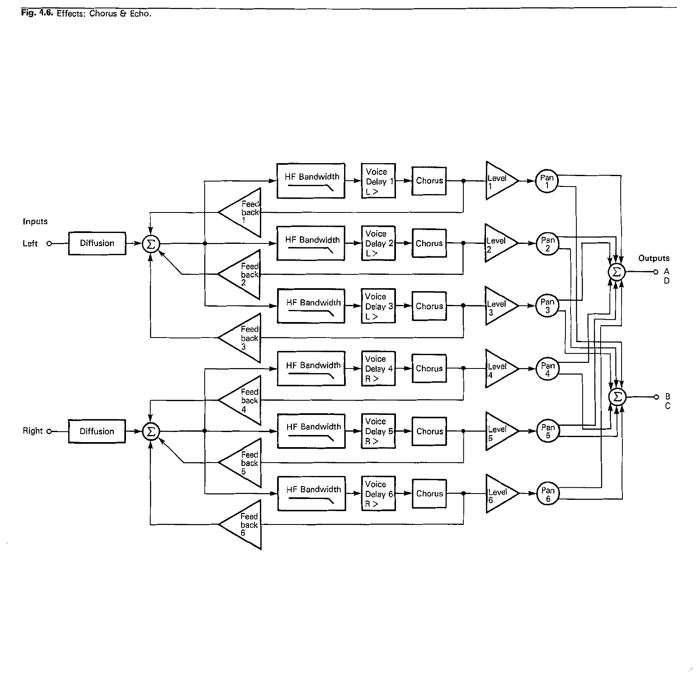

*Figure 4.6 — Effects: Chorus & Echo.*

#### Table 4.16 — Chorus & Echo: Control Pages and Variable Parameters

| Page | Slider | Parameter | Max | Min | Routing |
|---|---|---|---|---|---|
| 1 | 1 | Inactive | — | — | |
| 1 | 2 | Inactive | — | — | |
| 1 | 3 | Chorus | 97 | 00 | |
| 1 | 4 | HF Bandwidth | 19.0 kHz | 170 Hz | |
| 1 | 5 | Diffusion | 99 | 00 | |
| 1 | 6 | Inactive | — | — | |
| 2 | 1 | Voice Level 1 | 99 | 00 | L> |
| 2 | 2 | Voice Level 2 | 99 | 00 | L> |
| 2 | 3 | Voice Level 3 | 99 | 00 | L> |
| 2 | 4 | Voice Level 4 | 99 | 00 | R> |
| 2 | 5 | Voice Level 5 | 99 | 00 | R> |
| 2 | 6 | Voice Level 6 | 99 | 00 | R> |
| 3* | 1 | Voice Delay 1 | 896 msec | 0.00 msec | L> |
| 3* | 2 | Voice Delay 2 | 896 msec | 0.00 msec | L> |
| 3* | 3 | Voice Delay 3 | 896 msec | 0.00 msec | L> |
| 3* | 4 | Voice Delay 4 | 896 msec | 0.00 msec | R> |
| 3* | 5 | Voice Delay 5 | 896 msec | 0.00 msec | R> |
| 3* | 6 | Voice Delay 6 | 896 msec | 0.00 msec | R> |
| 4 | 1 | Feedback 1 | 97% | −97% | L> |
| 4 | 2 | Feedback 2 | 97% | −97% | L> |
| 4 | 3 | Feedback 3 | 97% | −97% | L> |
| 4 | 4 | Feedback 4 | 97% | −97% | R> |
| 4 | 5 | Feedback 5 | 97% | −97% | R> |
| 4 | 6 | Feedback 6 | 97% | −97% | R> |
| 5 | 1 | Pan 1 | 99 | 00 | CB-AD |
| 5 | 2 | Pan 2 | 99 | 00 | CB-AD |
| 5 | 3 | Pan 3 | 99 | 00 | CB-AD |
| 5 | 4 | Pan 4 | 99 | 00 | CB-AD |
| 5 | 5 | Pan 5 | 99 | 00 | CB-AD |
| 5 | 6 | Pan 6 | 99 | 00 | CB-AD |

### 4.4.2 Resonant Chords — Program 2

The Resonant Chords program is unlike anything that has ever appeared in a delay device. It uses impulsive energy at the input to excite six resonant notes. The level, pitch, duration of ringing, and high-frequency rolloff of the overtones of each note are all separately controllable.

The notes resonate to some degree with almost any input, but the most effective excitation contains all frequencies, like percussion. A fairly simple drum track works, as does a timed pulse, such as a metronome. Other instruments, such as guitars, may give a quality of tonal ambience in which certain notes rise out of the background in an ethereal way.

This program has six control pages and only one variation. Table 4.17 lists the control pages and the variable parameter ranges. The control page configuration differs from those in the reverberation programs; the six pages control individual voices from the Right and Left inputs: the first three sliders affect signals from the Left input and the last three sliders affect signals from the Right.

Page 1 controls level, which determines the strength of each note.

Page 2 determines the frequency of the tone. The shorter the delay, the higher the frequency at which the feedback loop resonates: THE PITCH GOES DOWN AS THE SLIDER IS MOVED UPWARD.

Page 3 controls feedback, which determines how long the note resonates. The controls are zero-center, with positive feedback above and negative below. Positive feedback generates all the harmonics of each note, and negative feedback gives only the odd harmonics. The action of these sliders takes place almost entirely in the last 20% of their travel, where the magnitude of the feedback coefficient is between 85 and 97%. Lower values do not produce separately audible notes, but can be used for subtle equalization effects.

Page 4 controls predelay, which sets the timing of the notes. By gradually increasing the delay with each note, a pulse can become a strum or the notes can be synchronized with the internal rhythms of the drum track.

Page 5 assigns the notes to the two output channels. As the sliders are moved from bottom to top, the sound pans from Outputs C and B to Outputs A and D.

Page 6 has two functions: (1) slider 1 feeds the output of Predelay 3 back to the Left input and the output of the Predelay 6 back to the Right input; in addition, slider 2 also controls feedback from 3 and 6 Predelays, but reverses them, so feedback from Predelay 6 goes to the left input and feedback from Predelay 3 goes to the right input (see Fig. 4.7), and (2) sliders 3 and 4 control HF Bandwidth for the recirculation associated with the Left and Right inputs, respectively.

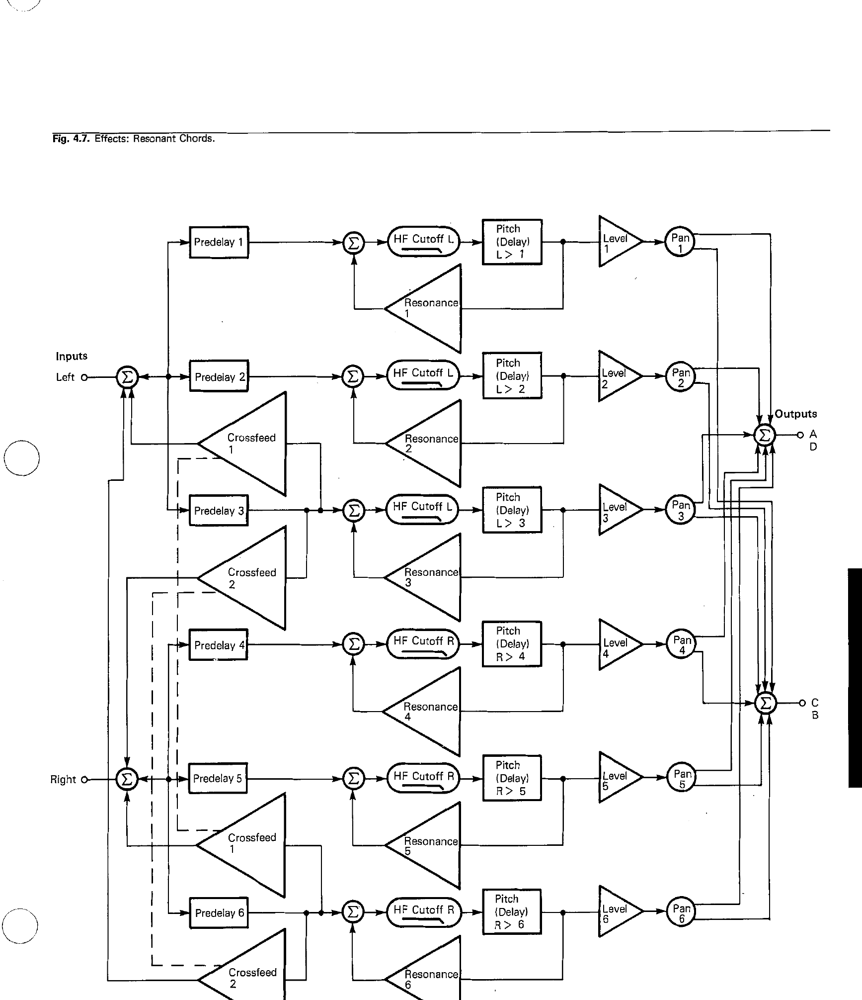

*Figure 4.7 — Effects: Resonant Chords.*

#### Table 4.17 — Resonant Chords: Control Pages and Variable Parameters

| Page | Slider | Parameter | Max | Min | Routing |
|---|---|---|---|---|---|
| 1 | 1 | Note Level 1 | 99 | 00 | L> |
| 1 | 2 | Note Level 2 | 99 | 00 | L> |
| 1 | 3 | Note Level 3 | 99 | 00 | L> |
| 1 | 4 | Note Level 4 | 99 | 00 | R> |
| 1 | 5 | Note Level 5 | 99 | 00 | R> |
| 1 | 6 | Note Level 6 | 99 | 00 | R> |
| 2* | 1 | Note Pitch 1 | 31.3 msec | 0.00 msec | L> |
| 2* | 2 | Note Pitch 2 | 31.3 msec | 0.00 msec | L> |
| 2* | 3 | Note Pitch 3 | 31.3 msec | 0.00 msec | L> |
| 2* | 4 | Note Pitch 4 | 31.3 msec | 0.00 msec | R> |
| 2* | 5 | Note Pitch 5 | 31.3 msec | 0.00 msec | R> |
| 2* | 6 | Note Pitch 6 | 31.3 msec | 0.00 msec | R> |
| 3 | 1 | Resonance 1 | 97% | −97% | L> |
| 3 | 2 | Resonance 2 | 97% | −97% | L> |
| 3 | 3 | Resonance 3 | 97% | −97% | L> |
| 3 | 4 | Resonance 4 | 97% | −97% | R> |
| 3 | 5 | Resonance 5 | 97% | −97% | R> |
| 3 | 6 | Resonance 6 | 97% | −97% | R> |
| 4 | 1 | Predelay 1 | 864 msec | 0.00 msec | L> |
| 4 | 2 | Predelay 2 | 864 msec | 0.00 msec | L> |
| 4 | 3 | Predelay 3 | 864 msec | 0.00 msec | L> |
| 4 | 4 | Predelay 4 | 864 msec | 0.00 msec | R> |
| 4 | 5 | Predelay 5 | 864 msec | 0.00 msec | R> |
| 4 | 6 | Predelay 6 | 864 msec | 0.00 msec | R> |
| 5 | 1 | Pan 1 | 99 | 00 | CB-AD |
| 5 | 2 | Pan 2 | 99 | 00 | CB-AD |
| 5 | 3 | Pan 3 | 99 | 00 | CB-AD |
| 5 | 4 | Pan 4 | 99 | 00 | CB-AD |
| 5 | 5 | Pan 5 | 99 | 00 | CB-AD |
| 5 | 6 | Pan 6 | 99 | 00 | CB-AD |
| 6 | 1 | Crossfeed (1) | 99% | 00 | |
| 6 | 2 | Crossfeed (2) | 99% | 00 | |
| 6 | 3 | HF Cutoff L | 19.0 kHz | 170 Hz | |
| 6 | 4 | HF Cutoff R | 19.0 kHz | 170 Hz | |
| 6 | 5 | Inactive | — | — | |
| 6 | 6 | Inactive | — | — | |

### 4.4.3 Multiband Delay — Program 3

The Multiband Delay program provides six separately adjustable delay outputs, each with its own high- and low-cut filters. It is a monaural input program, the inputs being digitally averaged.

This program has one variation with six control pages. Table 4.18 lists the control pages and the variable parameter ranges.

Page 1 adjusts the levels of individual bands.

Page 2 controls the delay. Short delays are good for slap-echo effects, but very long delays are also available for harmonizing and layering in real time.

Page 3 controls the low-frequency band edges of the high-pass filters, and page 4 controls the high-frequency band edges of the low-pass filters. These filters have a rolloff of 6 dB/octave.

Page 5 assigns the bands to the two output channels. As the sliders are moved from bottom to top, the sound pans from Outputs C and B to Outputs A and D.

Page 6 is the overall feedback page. Sliders 1 and 2 feed the outputs of the corresponding delays back to the input summing junction. Slider 5 controls diffusion at the input of the program; raising the diffusion spreads transients out in time, turning a click into a brush stroke. Sliders 3, 4, and 6 are inactive.

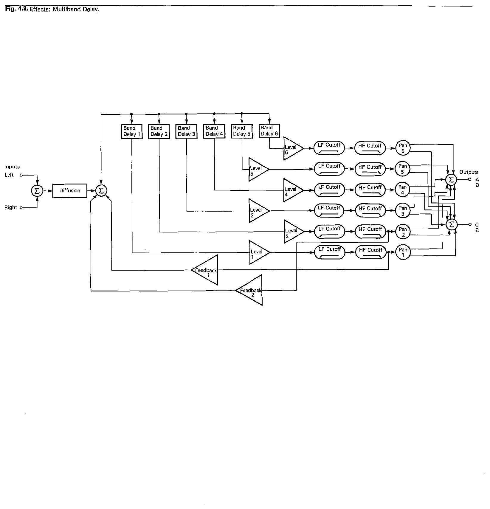

*Figure 4.8 — Effects: Multiband Delay.*

#### Table 4.18 — Multiband Delay: Control Pages and Variable Parameters

| Page | Slider | Parameter | Max | Min | Routing |
|---|---|---|---|---|---|
| 1 | 1 | Band Level 1 | 99 | 00 | L+R> |
| 1 | 2 | Band Level 2 | 99 | 00 | L+R> |
| 1 | 3 | Band Level 3 | 99 | 00 | L+R> |
| 1 | 4 | Band Level 4 | 99 | 00 | L+R> |
| 1 | 5 | Band Level 5 | 99 | 00 | L+R> |
| 1 | 6 | Band Level 6 | 99 | 00 | L+R> |
| 2* | 1 | Band Delay 1 | 1.86 sec | 0.00 msec | L+R> |
| 2* | 2 | Band Delay 2 | 1.86 sec | 0.00 msec | L+R> |
| 2* | 3 | Band Delay 3 | 1.86 sec | 0.00 msec | L+R> |
| 2* | 4 | Band Delay 4 | 1.86 sec | 0.00 msec | L+R> |
| 2* | 5 | Band Delay 5 | 1.86 sec | 0.00 msec | L+R> |
| 2* | 6 | Band Delay 6 | 1.86 sec | 0.00 msec | L+R> |
| 3 | 1 | LF Cutoff 1 | 19.0 kHz | 170 Hz | L+R> |
| 3 | 2 | LF Cutoff 2 | 19.0 kHz | 170 Hz | L+R> |
| 3 | 3 | LF Cutoff 3 | 19.0 kHz | 170 Hz | L+R> |
| 3 | 4 | LF Cutoff 4 | 19.0 kHz | 170 Hz | L+R> |
| 3 | 5 | LF Cutoff 5 | 19.0 kHz | 170 Hz | L+R> |
| 3 | 6 | LF Cutoff 6 | 19.0 kHz | 170 Hz | L+R> |
| 4 | 1 | HF Cutoff 1 | 19.0 kHz | 170 Hz | L+R> |
| 4 | 2 | HF Cutoff 2 | 19.0 kHz | 170 Hz | L+R> |
| 4 | 3 | HF Cutoff 3 | 19.0 kHz | 170 Hz | L+R> |
| 4 | 4 | HF Cutoff 4 | 19.0 kHz | 170 Hz | L+R> |
| 4 | 5 | HF Cutoff 5 | 19.0 kHz | 170 Hz | L+R> |
| 4 | 6 | HF Cutoff 6 | 19.0 kHz | 170 Hz | L+R> |
| 5 | 1 | Pan 1 | 99 | 00 | CB-AD |
| 5 | 2 | Pan 2 | 99 | 00 | CB-AD |
| 5 | 3 | Pan 3 | 99 | 00 | CB-AD |
| 5 | 4 | Pan 4 | 99 | 00 | CB-AD |
| 5 | 5 | Pan 5 | 99 | 00 | CB-AD |
| 5 | 6 | Pan 6 | 99 | 00 | CB-AD |
| 6 | 1 | Feedback 1 | 99% | 00 | |
| 6 | 2 | Feedback 2 | 99% | 00 | |
| 6 | 3 | Inactive | — | — | |
| 6 | 4 | Inactive | — | — | |
| 6 | 5 | Diffusion | 99 | 00 | |
| 6 | 6 | Inactive | — | — | |

---

## 4.5 Splits — Bank 5

The five Split programs (Hall/Hall, Plate/Plate, Plate/Hall, Plate/Chorus, and Rich Split) allow the 224X to become two independent reverb units, with each unit processing a single input. The 224X processes two independent reverb programs, each with its own variable parameters. To that end, the program's control pages are configured to accommodate individual inputs.

### 4.5.1 Hall/Hall — Program 1

This program processes each input with a Hall program similar to the Concert Hall program in bank 1. Table 4.19 lists the pages and variable parameter ranges. Note that the sliders on page 1 affect the signal entering the Left input and those on page 2 affect the Right input. In addition, the Dynamic Decay toggle affects only the Left input. There are also four Preechoes (two for each channel).

This program has one variation, which sounds basically the same as variation 1 of the Concert Hall program.

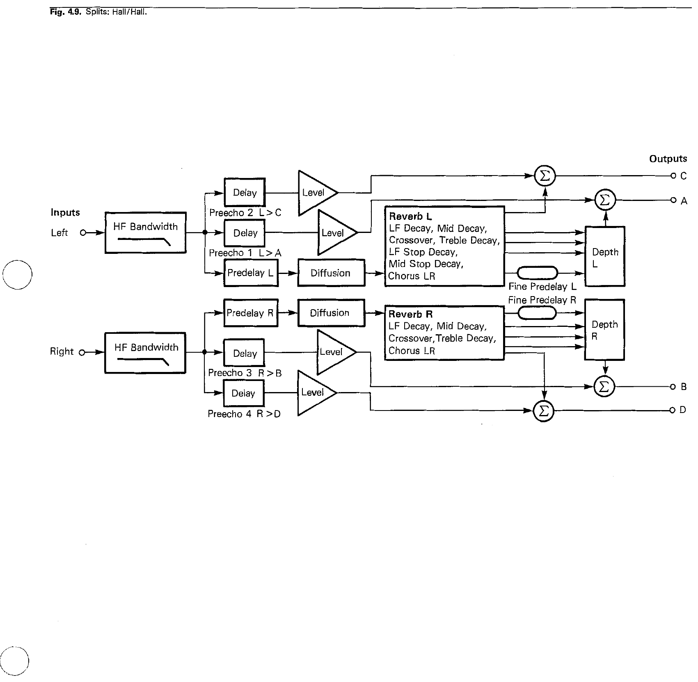

*Figure 4.9 — Splits: Hall/Hall.*

#### Table 4.19 — Hall/Hall: Control Pages and Variable Parameters

| Page | Slider | Parameter | Max | Min | Routing |
|---|---|---|---|---|---|
| 1 | 1 | LF Decay L | 70 sec | 0.6 sec | L |
| 1 | 2 | Mid Decay L | 70 sec | 0.6 sec | L |
| 1 | 3 | Crossover L | 19.0 kHz | 170 Hz | L |
| 1 | 4 | Treble Decay L | 19.0 kHz | 170 Hz | L |
| 1 | 5 | Depth | 99 | 00 | L>A |
| 1 | 6 | Predelay L | 176 msec | 24.0 msec | L |
| 2 | 1 | LF Decay R | 70 sec | 0.6 sec | R |
| 2 | 2 | Mid Decay R | 70 sec | 0.6 sec | R |
| 2 | 3 | Crossover R | 19.0 kHz | 170 Hz | R |
| 2 | 4 | Treble Decay R | 19.0 kHz | 170 Hz | R |
| 2 | 5 | Depth | 99 | 00 | R>B |
| 2 | 6 | Predelay R | 176 msec | 24.0 msec | R |
| 3 | 1 | LF Stop Decay | 70 sec | 0.6 sec | Decay L |
| 3 | 2 | Mid Stop Decay | 70 sec | 0.6 sec | Decay L |
| 3 | 3 | Chorus | 97 | 00 | LR |
| 3 | 4 | HF Bandwidth | 19.0 kHz | 170 Hz | LR |
| 3 | 5 | Diffusion | 99 | 00 | LR |
| 3 | 6 | Definition | 75 | 00 | LR |
| 4 | 1 | Preecho Level 1 | 99 | 00 | L>A |
| 4 | 2 | Preecho Level 2 | 99 | 00 | L>C |
| 4 | 3 | Preecho Level 3 | 99 | 00 | R>B |
| 4 | 4 | Preecho Level 4 | 99 | 00 | R>D |
| 4 | 5 | Inactive | — | — | |
| 4 | 6 | Inactive | — | — | |
| 5* | 1 | Preecho Delay 1 | 143 msec | 0.00 msec | L>A |
| 5* | 2 | Preecho Delay 2 | 143 msec | 0.00 msec | L>C |
| 5* | 3 | Preecho Delay 3 | 143 msec | 0.00 msec | R>B |
| 5* | 4 | Preecho Delay 4 | 143 msec | 0.00 msec | R>D |
| 5* | 5 | Fine Predelay | 31.3 msec | 0.00 msec | L>A |
| 5* | 6 | Fine Predelay | 31.3 msec | 0.00 msec | R>B |

### 4.5.2 Plate/Plate — Program 2

This program processes each input with a Plate program similar to the Plate program in bank 3. Table 4.20 lists the control pages and variable parameter ranges. As in the Hall/Hall program, the first two pages of sliders control separate inputs, and the four Preechoes are also configured the same.

This program has two variations, with variation 1 basically the same as variation 1 of the Plate program, and variation 2 being a modified version with high predelay (left = 85.0 milliseconds and right = 69.0 milliseconds). Variation 2 also includes four preset Preecho Delay times and four preset Preecho Levels.

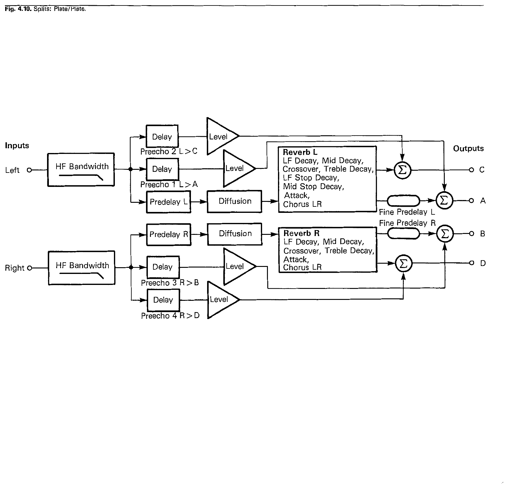

*Figure 4.10 — Splits: Plate/Plate.*

#### Table 4.20 — Plate/Plate: Control Pages and Variable Parameters

| Page | Slider | Parameter | Max | Min | Routing |
|---|---|---|---|---|---|
| 1 | 1 | LF Decay L | 70 sec | 0.6 sec | L |
| 1 | 2 | Mid Decay L | 70 sec | 0.6 sec | L |
| 1 | 3 | Crossover L | 19.0 kHz | 170 Hz | L |
| 1 | 4 | Treble Decay L | 19.0 kHz | 170 Hz | L |
| 1 | 5 | Attack L | 99 | 00 | L |
| 1 | 6 | Predelay L | 176 msec | 0.00 msec | L |
| 2 | 1 | LF Decay R | 70 sec | 0.6 sec | R |
| 2 | 2 | Mid Decay R | 70 sec | 0.6 sec | R |
| 2 | 3 | Crossover R | 19.0 kHz | 170 Hz | R |
| 2 | 4 | Treble Decay R | 19.0 kHz | 170 Hz | R |
| 2 | 5 | Attack R | 99 | 00 | R |
| 2 | 6 | Predelay R | 176 msec | 0.00 msec | R |
| 3 | 1 | LF Stop Decay | 70 sec | 0.6 sec | Decay L |
| 3 | 2 | Mid Stop Decay | 70 sec | 0.6 sec | Decay L |
| 3 | 3 | Chorus | 97 | 00 | LR |
| 3 | 4 | HF Bandwidth | 19.0 kHz | 170 Hz | LR |
| 3 | 5 | Diffusion | 99 | 00 | LR |
| 3 | 6 | Definition | 75 | 00 | LR |
| 4 | 1 | Preecho Level 1 | 99 | 00 | L>A |
| 4 | 2 | Preecho Level 2 | 99 | 00 | L>C |
| 4 | 3 | Preecho Level 3 | 99 | 00 | R>B |
| 4 | 4 | Preecho Level 4 | 99 | 00 | R>D |
| 4 | 5 | Inactive | — | — | |
| 4 | 6 | Inactive | — | — | |
| 5* | 1 | Preecho Delay 1 | 170 msec | 0.00 msec | L>A |
| 5* | 2 | Preecho Delay 2 | 170 msec | 0.00 msec | L>C |
| 5* | 3 | Preecho Delay 3 | 170 msec | 0.00 msec | R>B |
| 5* | 4 | Preecho Delay 4 | 170 msec | 0.00 msec | R>D |
| 5* | 5 | Fine Predelay | 30.2 msec | 0.00 msec | L>A |
| 5* | 6 | Fine Predelay | 30.2 msec | 0.00 msec | R>B |

### 4.5.3 Plate/Hall — Program 3

This program processes the Left input with the Plate program and the Right input with the Concert Hall program. Table 4.21 lists the control pages and variable parameter ranges. The control pages are configured the same as the Hall/Hall and Plate/Plate programs.

This program has one variation, with the Left input being processed with a sound similar to variation 1 of the Plate program and the Right input being processed with a sound similar to variation 1 of the Concert Hall program.

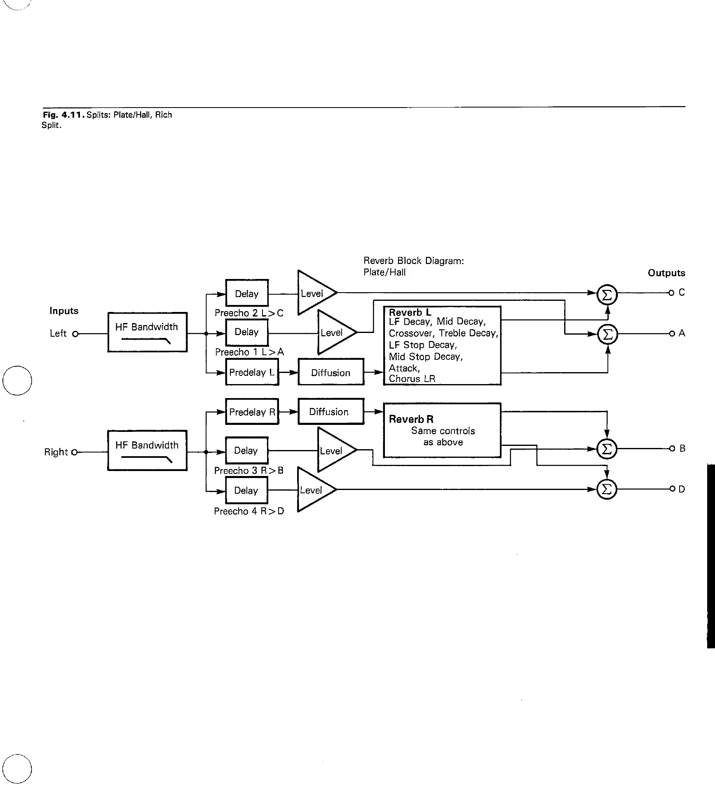

*Figure 4.11 — Splits: Plate/Hall, Rich Split.*

#### Table 4.21 — Plate/Hall: Control Pages and Variable Parameters

| Page | Slider | Parameter | Max | Min | Routing |
|---|---|---|---|---|---|
| 1 | 1 | LF Decay L | 70 sec | 0.6 sec | L |
| 1 | 2 | Mid Decay L | 70 sec | 0.6 sec | L |
| 1 | 3 | Crossover L | 19.0 kHz | 170 Hz | L |
| 1 | 4 | Treble Decay L | 19.0 kHz | 170 Hz | L |
| 1 | 5 | Attack L | 99 | 00 | L |
| 1 | 6 | Predelay L | 184 msec | 0.00 msec | L |
| 2 | 1 | LF Decay R | 70 sec | 0.6 sec | R |
| 2 | 2 | Mid Decay R | 70 sec | 0.6 sec | R |
| 2 | 3 | Crossover R | 19.0 kHz | 170 Hz | R |
| 2 | 4 | Treble Decay R | 19.0 kHz | 170 Hz | R |
| 2 | 5 | Depth | 99 | 00 | R>B |
| 2 | 6 | Predelay R | 184 msec | 0.00 msec | R |
| 3 | 1 | LF Stop Decay | 70 sec | 0.6 sec | Decay L |
| 3 | 2 | Mid Stop Decay | 70 sec | 0.6 sec | Decay L |
| 3 | 3 | Chorus | 97 | 00 | LR |
| 3 | 4 | HF Bandwidth | 19.0 kHz | 170 Hz | LR |
| 3 | 5 | Diffusion | 99 | 00 | LR |
| 3 | 6 | Definition | 75 | 00 | LR |
| 4 | 1 | Preecho Level 1 | 99 | 00 | L>A |
| 4 | 2 | Preecho Level 2 | 99 | 00 | L>C |
| 4 | 3 | Preecho Level 3 | 99 | 00 | R>B |
| 4 | 4 | Preecho Level 4 | 99 | 00 | R>D |
| 4 | 5 | Inactive | — | — | |
| 4 | 6 | Inactive | — | — | |
| 5* | 1 | Preecho Delay 1 | 179 msec | 0.00 msec | L>A |
| 5* | 2 | Preecho Delay 2 | 179 msec | 0.00 msec | L>C |
| 5* | 3 | Preecho Delay 3 | 179 msec | 0.00 msec | R>B |
| 5* | 4 | Preecho Delay 4 | 179 msec | 0.00 msec | R>D |
| 5* | 5 | Inactive | — | — | |
| 5* | 6 | Inactive | — | — | |

### 4.5.4 Plate/Chorus — Program 4

This program combines two of the most generally useful programs in the 224X. With it you can combine chorusing and reverb on a single track or use the two sounds on different tracks at the same time. Table 4.22 lists the control pages and variable parameter ranges. The Left input is processed with the Plate program, and the Right input is processed with a modified Chorus & Echo program. There is only one variation.

As in the preceding Split programs, the Plate program retains virtually all of the features of the main Plate program, except that mode enhancement is inactive and therefore the Chorus slider has no effect (the Mode Enhancement toggle and the Chorus slider are active for the Chorus section of this program, however). In addition, this Plate program does not have Preechoes. The size of the plate is adjustable.

The Chorus program offers five voices (similar to the six voices in the Chorus & Echo program). Note that the HF Bandwidth and Diffusion controls apply to the Plate program only. Each voice in this Chorus program has full bandwidth and is not spread out by diffusion. Voices 1, 2, and 3 are in phase with the input and voices 4 and 5 are out of phase. The out-of-phase voices can be used to create a wonderful inverted flanging effect by setting their delays and pans within a few milliseconds of one or more of the noninverted voices. If cancellation is not desired, voices 4 and 5 can simply be spaced more than 7 milliseconds away from voices 1, 2, and 3.

A very interesting effect can be created with the Plate/Chorus program by panning all the voices in the Chorus program to one channel and using this output as the Left input feed to the Plate program — the resulting combination is excellent on musical material with long sustains, particularly synthesizer material.

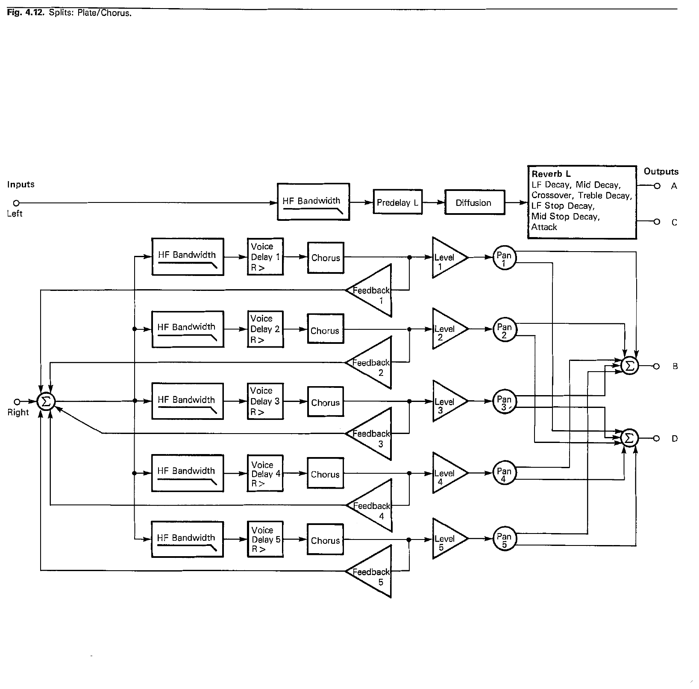

*Figure 4.12 — Splits: Plate/Chorus.*

#### Table 4.22 — Plate/Chorus: Control Pages and Variable Parameters

*(Per the 224XL errata, Size maximum on page 7 should read 70 meters.)*

| Page | Slider | Parameter | Max | Min | Routing |
|---|---|---|---|---|---|
| 1 | 1 | LF Decay L | 70 sec | 0.6 sec | L |
| 1 | 2 | Mid Decay L | 70 sec | 0.6 sec | L |
| 1 | 3 | Crossover L | 19.0 kHz | 170 Hz | L |
| 1 | 4 | Treble Decay L | 19.0 kHz | 170 Hz | L |
| 1 | 5 | Attack L | 99 | 00 | L |
| 1 | 6 | Predelay L | 136 msec | 0.00 msec | L |
| 2 | 1 | LF Stop Decay L | 70 sec | 0.6 sec | L |
| 2 | 2 | Mid Stop Decay L | 70 sec | 0.6 sec | L |
| 2 | 3 | Chorus | 97 | 00 | R |
| 2 | 4 | HF Bandwidth L | 19.0 kHz | 170 Hz | L |
| 2 | 5 | Diffusion L | 99 | 00 | L |
| 2 | 6 | Definition L | 75 | 00 | L |
| 3 | 1 | Voice Level 1 | 99 | 00 | R> |
| 3 | 2 | Voice Level 2 | 99 | 00 | R> |
| 3 | 3 | Voice Level 3 | 99 | 00 | R> |
| 3 | 4 | Voice Level 4 | 99 | 00 | R> |
| 3 | 5 | Voice Level 5 | 99 | 00 | R> |
| 3 | 6 | Inactive | — | — | |
| 4* | 1 | Voice Delay 1 | 430 msec | 0.00 msec | R> |
| 4* | 2 | Voice Delay 2 | 430 msec | 0.00 msec | R> |
| 4* | 3 | Voice Delay 3 | 430 msec | 0.00 msec | R> |
| 4* | 4 | Voice Delay 4 | 430 msec | 0.00 msec | R> |
| 4* | 5 | Voice Delay 5 | 430 msec | 0.00 msec | R> |
| 4* | 6 | Inactive | — | — | |
| 5 | 1 | Feedback Gain 1 | 97% | −97% | R> |
| 5 | 2 | Feedback Gain 2 | 97% | −97% | R> |
| 5 | 3 | Feedback Gain 3 | 97% | −97% | R> |
| 5 | 4 | Feedback Gain 4 | 97% | −97% | R> |
| 5 | 5 | Feedback Gain 5 | 97% | −97% | R> |
| 5 | 6 | Inactive | — | — | |
| 6 | 1 | Pan 1 | 99 | 00 | B-D |
| 6 | 2 | Pan 2 | 99 | 00 | B-D |
| 6 | 3 | Pan 3 | 99 | 00 | B-D |
| 6 | 4 | Pan 4 | 99 | 00 | B-D |
| 6 | 5 | Pan 5 | 99 | 00 | B-D |
| 6 | 6 | Inactive | — | — | |
| 7 | 1 | Size | 80 meters *(errata: 70)* | 08 meters | |
| 7 | 3 | Gate | 5.08 sec | 0.00 sec | |

### 4.5.5 Rich Split — Program 5

The Rich Split program provides two independent programs which sound similar to the Rich Chamber program. Each side of the Rich Split has a Size control, allowing the creation of two small rooms, a small room and a large room, two large rooms, or anything in between.

The Rich Split program has six control pages and only one variation. Table 4.23 lists the control pages and variable parameter ranges. (Rich Split shares the block topology shown in Figure 4.11, above.)

#### Table 4.23 — Rich Split: Control Pages and Variable Parameters

*(`*` = value can also be set to infinite.)*

| Page | Slider | Parameter | Max | Min | Routing |
|---|---|---|---|---|---|
| 1 | 1 | Left LF Decay | 67 sec * | 0.1 sec | |
| 1 | 2 | Left Mid Decay | 67 sec * | 0.1 sec | |
| 1 | 3 | Left Crossover | 19.0 kHz * | 170 Hz | |
| 1 | 4 | Left Treble Decay | 19.0 kHz * | 170 Hz | |
| 1 | 5 | Left Attack | 99 | 00 | |
| 1 | 6 | Left Predelay | 350 ms | 0.00 ms | |
| 2 | 1 | Right LF Decay | 67 sec * | 0.1 sec | |
| 2 | 2 | Right Mid Decay | 67 sec * | 0.1 sec | |
| 2 | 3 | Right Crossover | 19.0 kHz * | 170 Hz | |
| 2 | 4 | Right Treble Decay | 19.0 kHz * | 170 Hz | |
| 2 | 5 | Right Attack | 99 | 00 | |
| 2 | 6 | Right Predelay | 350 ms | 000 ms | |
| 3 | 1 | LF Stop Decay | 67 sec * | 0.1 sec | L |
| 3 | 2 | Mid Stop Decay | 67 sec * | 0.1 sec | L |
| 3 | 3 | Chorus | 99 | 00 | L/R |
| 3 | 4 | HF Bandwidth | 19 kHz * | 170 Hz | L/R |
| 3 | 5 | Diffusion | 99 | 00 | L/R |
| 3 | 6 | Definition | 99 | 00 | L/R |
| 4 | 1 | Preecho Level 1 | 99 | 00 | L>A |
| 4 | 2 | Preecho Level 2 | 99 | 00 | L>C |
| 4 | 3 | Preecho Level 3 | 99 | 00 | R>B |
| 4 | 4 | Preecho Level 4 | 99 | 00 | R>D |
| 4 | 5 | Inactive | — | — | |
| 4 | 6 | Inactive | — | — | |
| 5 | 1 | Preecho Delay 1 | 125 ms | 0.00 ms | L>A |
| 5 | 2 | Preecho Delay 2 | 125 ms | 0.00 ms | L>C |
| 5 | 3 | Preecho Delay 3 | 125 ms | 0.00 ms | R>B |
| 5 | 4 | Preecho Delay 4 | 125 ms | 0.00 ms | R>D |
| 5 | 5 | Fine Preecho Delay | 125 ms | 0.00 ms | L>A |
| 5 | 6 | Fine Preecho Delay | 125 ms | 0.00 ms | R>B |
| 6 | 1 | Left Size | 70 meters | 08 meters | |
| 6 | 2 | Right Size | 70 meters | 08 meters | |
| 6 | 3 | Reverb Stop Delay (Gate) | 1.26 sec | 0.00 sec | |
| 6 | 4 | Inactive | — | — | |
| 6 | 5 | Inactive | — | — | |
| 6 | 6 | Inactive | — | — | |

---

## 4.6 Program Block Diagrams

The original manual collects all program block diagrams in this section. They are reproduced above, inline with the programs they document. The index below maps each figure to its image file and the programs it covers.

| Figure | Title | Programs covered | Image |
|---|---|---|---|
| 4.1 | Reverb: Concert Hall, Bright Hall, and Room | Concert Hall, Bright Hall, Room | `images/fig-4-1-reverb-concert-bright-room.png` |
| 4.2 | Reverb: Dark Hall and Small Room | Dark Hall, Small Room | `images/fig-4-2-reverb-dark-hall-small-room.png` |
| 4.3 | Reverb: Chamber | Chamber | `images/fig-4-3-reverb-chamber.png` |
| 4.4 | Reverb: Rich Chamber, Dark Chamber | Rich Chamber, Dark Chamber (and Inverse Room) | `images/fig-4-4-reverb-rich-dark-chamber.png` |
| 4.5 | Reverb: Plate, Small Plate, CD Plate A, CD Plate B, Rich Plate | Plate family | `images/fig-4-5-reverb-plate-family.png` |
| 4.6 | Effects: Chorus & Echo | Chorus & Echo | `images/fig-4-6-effects-chorus-echo.png` |
| 4.7 | Effects: Resonant Chords | Resonant Chords | `images/fig-4-7-effects-resonant-chords.png` |
| 4.8 | Effects: Multiband Delay | Multiband Delay | `images/fig-4-8-effects-multiband-delay.png` |
| 4.9 | Splits: Hall/Hall | Hall/Hall | `images/fig-4-9-splits-hall-hall.png` |
| 4.10 | Splits: Plate/Plate | Plate/Plate | `images/fig-4-10-splits-plate-plate.png` |
| 4.11 | Splits: Plate/Hall, Rich Split | Plate/Hall, Rich Split | `images/fig-4-11-splits-plate-hall-rich-split.png` |
| 4.12 | Splits: Plate/Chorus | Plate/Chorus | `images/fig-4-12-splits-plate-chorus.png` |

---

*End of Chapter 4.*
